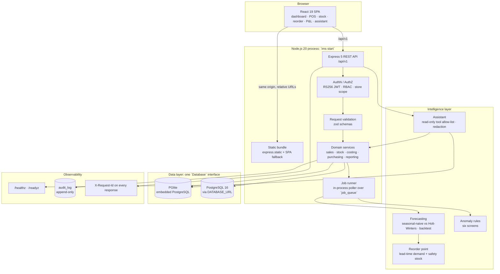
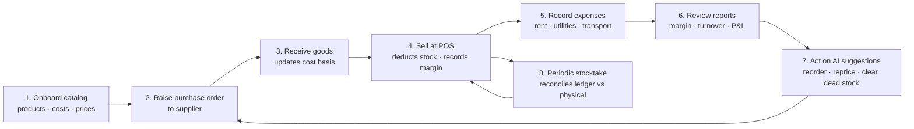
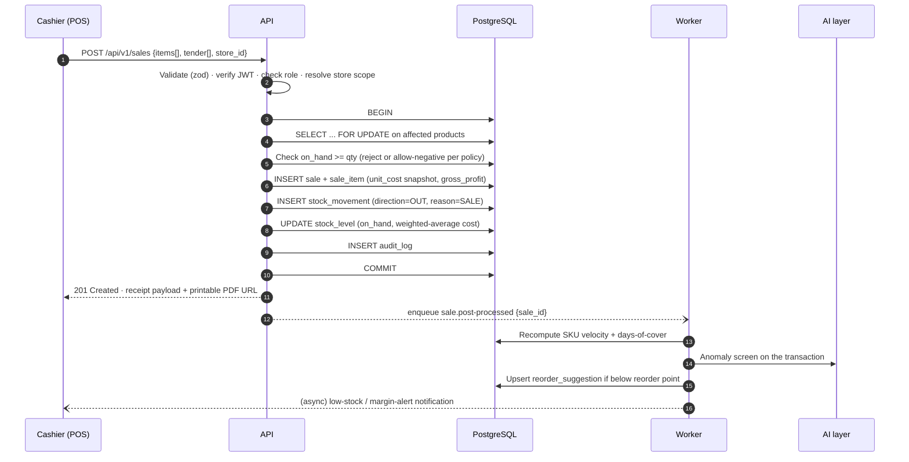
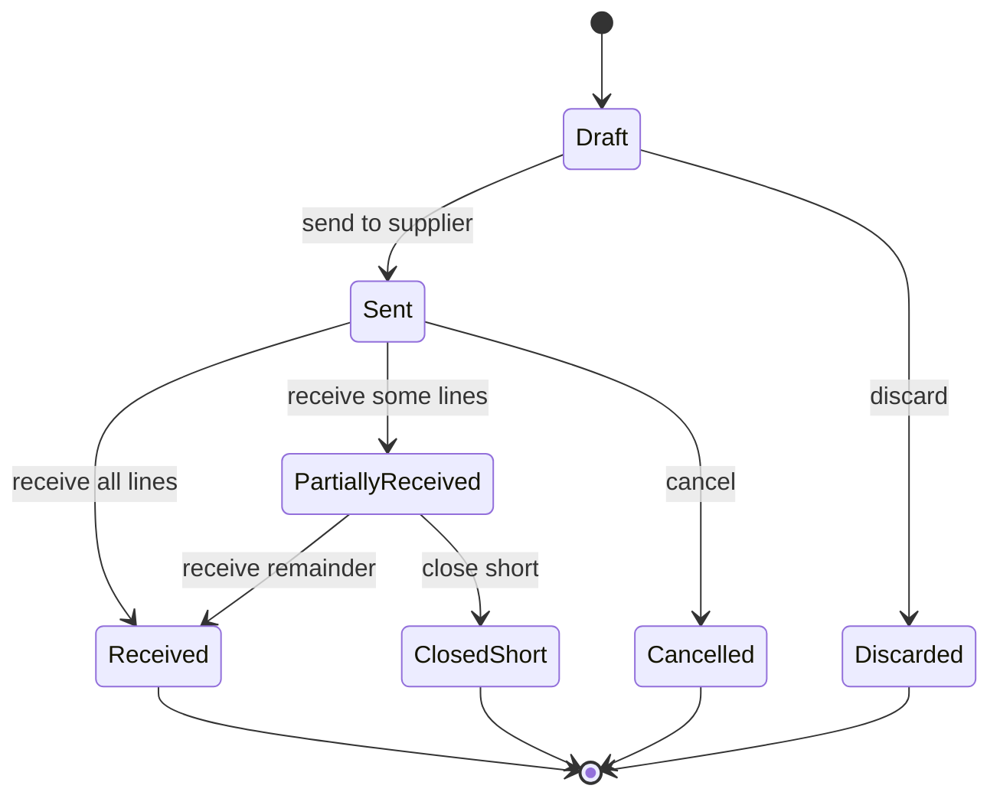
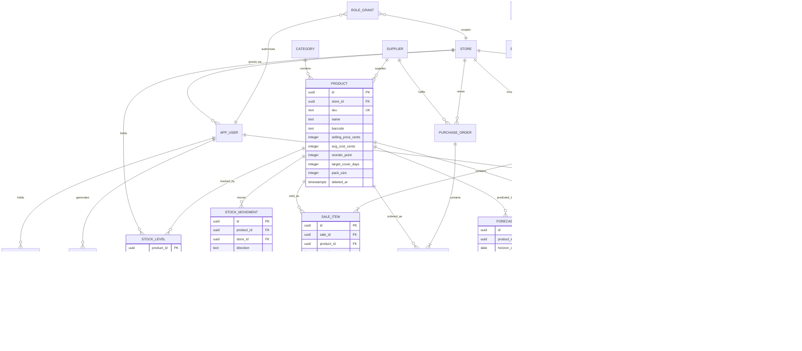
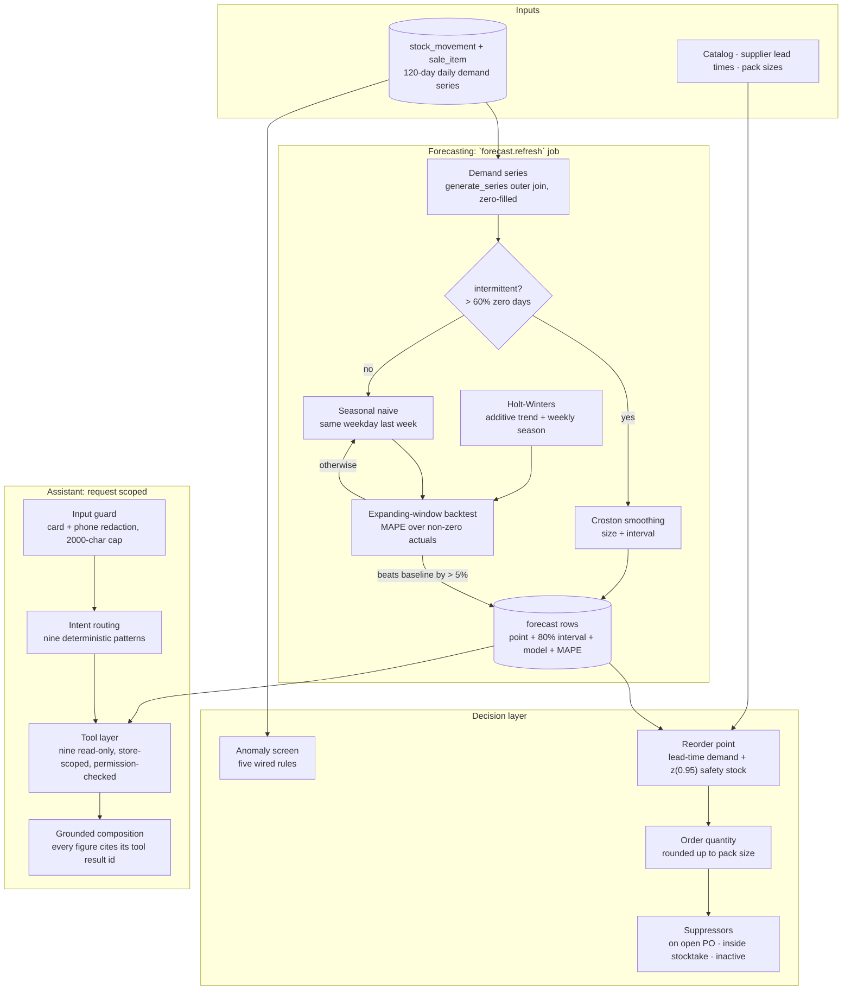
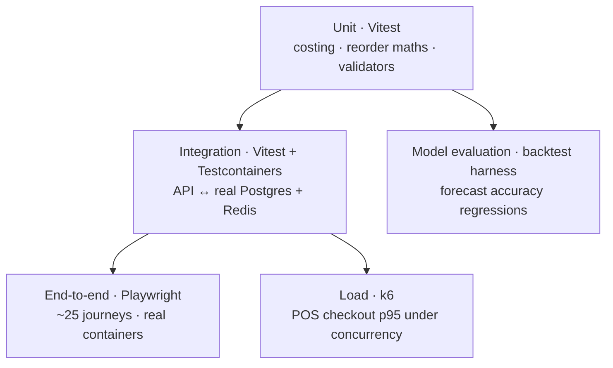
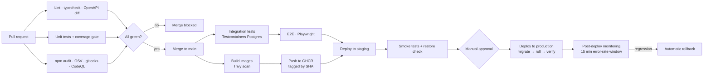

<div align="center">

# Inventory Management System

**Sales, stock and profitability intelligence for small-scale stores.**

A single-source-of-truth platform that tracks every unit in and out of a store, prices it
accurately at the moment of sale, and turns the resulting ledger into margin, turnover and
restock decisions the owner can act on the same day.


</div>

---

> ### 📌 Current state of this repository
>
> **The system is implemented and running.** This checkout contains a working
> TypeScript monorepo: an Express REST API, a React single-page app, an embedded
> PostgreSQL, a background job runner, the forecasting/reorder/anomaly layer and
> the assistant. It ships as a single executable: `node bin/ims.js start` boots
> the API and the web UI with no database server, no Redis and no Docker.
>
> ```bash
> pnpm install && pnpm build
> node bin/ims.js seed      # 38 SKUs, ~3,400 sales, 5 months of expenses
> node bin/ims.js start     # http://localhost:3000
> ```
>
> Sign in as `owner@demo.ims` / `Demo!Owner2026`.
>
> **Verified:** 61 automated tests pass (29 unit, 32 integration against a real
> PostgreSQL), `tsc --noEmit` is clean under `strict`, and both bundles build.
>
> **Two deliberate deviations from the original blueprint**, both driven by
> constraints found during implementation:
>
> | Planned | Shipped | Why |
> |---|---|---|
> | Prisma ORM | A thin SQL data layer with two drivers (`PGlite`, `pg`) | Prisma's query engine downloads from `binaries.prisma.sh` at install time, which is unreachable in restricted networks. The SQL layer has no such dependency. |
> | BullMQ on Redis | A durable `job_queue` table with an in-process poller | Removes a required service from a 2 vCPU single-machine install. The `Queue` interface is the swap point. |
>
> Every section still carries a status badge so intent is never confused with
> shipped behaviour.
>
> | Badge | Meaning |
> |---|---|
> |  | Implemented and covered by automated checks |
> |  | Core implemented, part of the spec still open |
> |  | Specified here, not yet implemented |

---

## Table of contents

1. [Rationale and Purpose](#1-rationale-and-purpose)
2. [Architecture diagram](#2-architecture-diagram)
3. [System workflow](#3-system-workflow)
4. [Feature list](#4-feature-list)
5. [API documentation](#5-api-documentation)
6. [Database schema](#6-database-schema)
7. [AI architecture](#7-ai-architecture)
8. [Security considerations](#8-security-considerations)
9. [Testing](#9-testing)
10. [Docker setup](#10-docker-setup)
11. [CI/CD](#11-cicd)
12. [Screenshots](#12-screenshots)
13. [Demo](#13-demo)

---

## 1. Rationale and Purpose


### The problem

Small-scale stores: sari-sari stores, neighbourhood groceries, hardware and farm-supply
outlets, campus canteens, mini-pharmacies: overwhelmingly run on paper notebooks, a
spreadsheet, or the owner's memory. That produces four concrete, measurable failures:

| Failure mode | What it costs the store |
|---|---|
| **Unknown true margin** | Prices are set against the *last* purchase price, not the cost of the units actually sold. Wholesale price movement silently erodes gross margin for weeks before anyone notices. |
| **Stock-outs on fast movers** | The best-selling SKUs run empty mid-week. Lost sales are invisible because an unrecorded sale leaves no trace. |
| **Cash trapped in slow movers** | Capital sits in items that have not moved in 90+ days, expiring or losing value, with no report surfacing it. |
| **No profitability picture** | Revenue is known; profit is not. Rent, utilities, transport and spoilage are paid from the till and never attributed to a period, so "how did this month go?" has no answer. |

Existing tools do not fit this segment: enterprise WMS/ERP suites are priced, configured and
staffed for warehouses, while consumer stock apps treat a store as a flat list of quantities
with no costing, no supplier ordering, and no profit reporting.

### Purpose

Provide a **low-cost, low-friction, offline-tolerant** system that gives a small-store owner:

1. **A complete stock ledger**: every unit in, out, returned, spoiled or counted, attributed
   to a user, a timestamp and a reason. Nothing is editable after the fact; corrections are
   made with reversing entries so the history stays auditable.
2. **Accurate, point-in-time profitability**: each sold line records the cost basis of the
   units consumed, so gross margin is a fact rather than an estimate, and net profit is gross
   margin minus the period's recorded operating expenses.
3. **Forward-looking replenishment**: demand forecasts and reorder-point suggestions generated
   from the store's own sales history, surfaced as a single actionable list.
4. **Answers in plain language**: an assistant the owner can ask ("which items lost money last
   week?", "what should I reorder before Friday?") without learning a reporting UI.

### Scope

| In scope | Out of scope (for now) |
|---|---|
| Products, categories, units, barcodes | Manufacturing / bill of materials |
| Suppliers, purchase orders, goods receiving | Full double-entry general ledger |
| POS sales, returns, receipts, tenders | Payroll, HR, tax filing |
| Stock adjustments, transfers, stocktakes | Warehouse robotics / conveyor integration |
| Operating expenses and period P&L | Multi-currency consolidation |
| Margin, turnover, ageing, dead-stock reporting | Marketplace / e-commerce storefront |
| Demand forecasting, reorder suggestions, anomaly detection | Hardware driver bundles (bundled later) |
| Single store, with multi-outlet ready in the schema | Franchise consolidation reporting |

### Non-functional requirements

| Requirement | Target | Rationale |
|---|---|---|
| POS checkout latency | p95 < 400 ms server-side | Queue length is the owner's primary pain |
| Availability | 99.5 % during trading hours | A store cannot stop selling |
| Offline tolerance | Sales queueable locally for ≥ 24 h, then synced | Connectivity in target regions is intermittent |
| Recovery point objective | ≤ 15 min | Nightly-plus-WAL backup |
| Recovery time objective | ≤ 1 h | Single-node restore from image + dump |
| Runs on | 2 vCPU / 4 GB VM, or a small on-prem box | Cost ceiling for the segment |
| Localisation | en, fil; currency `PHP` default, configurable | Primary market |

---

## 2. Architecture diagram


>
> **Shipped difference:** the diagram shows Prisma and BullMQ/Redis. The build
> uses a SQL data layer over PGlite/`pg` and a durable `job_queue` table instead;
> module boundaries are unchanged, so either can be swapped in later.

### 2.1 System context

The shipped topology. One Node process serves the API, the built web bundle and
the background worker; the database is either embedded (PGlite) or a PostgreSQL
server, selected by `DATABASE_URL`.



### 2.2 Architectural decisions

Decisions 5, 6 and 9 were revised during implementation; the revision and its
cause are recorded rather than silently absorbed.

| # | Decision | Alternatives considered | Why this one |
|---|---|---|---|
| 1 | **Modular monolith** (Express + typed service layer), not microservices | Service-per-domain | A 2 vCPU deployment budget cannot operate a fleet of services. Module boundaries (`catalog`, `inventory`, `sales`, `purchasing`, `reporting`, `ai`) are enforced by imports so the worker and the AI layer can be split out later without a rewrite. |
| 2 | **Append-only `stock_movement` ledger** with a derived `stock_level` cache | Mutable quantity column | An editable quantity can never be reconciled after the fact. A ledger makes every balance recomputable, gives free audit history, and is the input the forecasters need. |
| 3 | **Cost basis snapshotted onto `sale_item`** | Recompute margin from current product cost | Wholesale prices move. Recomputing rewrites history and makes last month's report differ from what was reported last month. |
| 4 | **TypeScript end to end**, `strict` + `noUncheckedIndexedAccess` | Untyped JS | Runtime validation at the boundary and static types over the same shapes; a missing array element is a compile error, not a crash at 2 a.m. |
| 5 | **A thin SQL data layer** with two drivers behind one `Database` interface: *revised from Prisma* | Prisma, TypeORM, Drizzle | Prisma downloads its query engine from `binaries.prisma.sh` at install time and fails on restricted networks. One interface means the same SQL runs on an embedded PostgreSQL in development and on PostgreSQL 16 in production, parameterised throughout. |
| 6 | **A durable `job_queue` table** with an in-process poller: *revised from BullMQ on Redis* | BullMQ, `setInterval`, OS cron | Removes a required service from a single-machine install. Jobs are claimed with `UPDATE … RETURNING`, retried to a bounded attempt count, and survive a restart because they live in the database. The `Queue` interface is the swap point for BullMQ later. |
| 7 | **REST + JSON envelopes** | GraphQL | POS clients issue a small, fixed set of calls; there is no resolver complexity to justify. |
| 8 | **The assistant calls tools; it never touches SQL** | Direct database access from the model | Free-form SQL from a model is an unbounded read on data scoped by store and role. Tools are parameterised, allow-listed and permission-checked server-side. |
| 9 | **PostgreSQL as the only system of record**: *revised to include an embedded build of it* | SQLite for local dev, Redis as a store | PGlite is a real PostgreSQL compiled to WASM, so the SQL, the constraints and the transaction semantics are identical in development and production. Redis is not used at all. |
| 10 | **One process serves API + UI + worker** | Separate web server | `ims start` on a shop counter's machine should be one command with one port and one thing to keep running. |

### 2.3 Repository layout

As shipped. `dist/` and `.ims-data/` are generated and git-ignored.

```text
inventory-management-system/
├── bin/ims.js                     # executable CLI: start · seed · migrate · reset · doctor
├── apps/
│   ├── api/
│   │   ├── src/
│   │   │   ├── main.ts            # app wiring, static bundle, health probes, bootstrap
│   │   │   ├── seed.ts            # deterministic demo store (fixed PRNG seed)
│   │   │   ├── db/
│   │   │   │   ├── database.ts    # Database interface + PGlite and pg drivers
│   │   │   │   ├── migrate.ts     # forward-only SQL migrator
│   │   │   │   └── migrations/0001_init.sql
│   │   │   ├── domain/            # pure functions, no I/O: the unit-test surface
│   │   │   │   ├── costing.ts     # sale totals, moving average, margin, turnover
│   │   │   │   ├── forecast.ts    # seasonal naive, Holt-Winters, backtest, Croston
│   │   │   │   ├── reorder.ts     # reorder point, safety stock, order quantity
│   │   │   │   └── anomaly.ts     # six screening rules
│   │   │   ├── services/
│   │   │   │   ├── stock.ts       # applyMovement: the only writer of on-hand stock
│   │   │   │   └── sales.ts       # createSale · returnSale · voidSale
│   │   │   ├── modules/           # HTTP routers: auth catalog inventory sales
│   │   │   │                      #   purchasing reporting ai
│   │   │   ├── shared/            # errors, http envelope, security, RBAC, audit
│   │   │   └── worker/index.ts    # queue + job handlers
│   │   ├── test/unit/             # 29 tests over the domain layer
│   │   ├── test/integration/      # 32 tests over HTTP against a real PostgreSQL
│   │   └── vitest.config.ts
│   └── web/
│       ├── src/{App.tsx,api.ts,main.tsx,styles.css}
│       └── vite.config.ts         # dev proxy for /api to the API
├── docs/                          # reserved for ADRs and screenshots
├── .github/workflows/ci.yml
├── Dockerfile · docker-compose.yml · .dockerignore · .env.example
└── README.md
```

---

## 3. System workflow


>
> **Shipped difference:** the checkout sequence, PO state machine, movement
> reason codes and profit formulas are all implemented. The stocktake session lock
> (blocking sales on counted SKUs) is not yet enforced.

### 3.1 End-to-end operating loop



The loop is deliberately closed: sales generate the history that drives forecasting, and
forecasting feeds the next purchase order.

### 3.2 Point-of-sale checkout (critical path)



**Offline path.** When the POS cannot reach the API it writes the sale to a local IndexedDB
queue with a client-generated idempotency key, then replays on reconnect. The API deduplicates
on `Idempotency-Key`, so a retry after an ambiguous timeout never double-sells stock.

### 3.3 Purchasing lifecycle



Receiving is the only place the **cost basis** changes: the received quantity and landed unit
cost (including allocated freight) update the product's moving weighted-average cost, and every
subsequent sale snapshots that new figure.

### 3.4 Stock movement semantics

Every change to on-hand quantity is one row in `stock_movement`. There is no other way to
change stock.

| Direction | Reason | Triggered by | Effect on cost basis |
|---|---|---|---|
| `IN` | `PURCHASE` | Goods receipt | Recomputes weighted average |
| `IN` | `RETURN_FROM_CUSTOMER` | Sales return | Restores the snapshotted cost |
| `IN` | `ADJUSTMENT_UP` | Stocktake surplus / found stock | Uses current average cost |
| `IN` | `TRANSFER_IN` | Inter-outlet transfer | Carries the sending cost |
| `OUT` | `SALE` | POS checkout | No change (consumption) |
| `OUT` | `SPOILAGE` / `DAMAGE` | Write-off | No change; value hits COGS |
| `OUT` | `ADJUSTMENT_DOWN` | Stocktake shortfall | No change; variance is costed |
| `OUT` | `TRANSFER_OUT` | Inter-outlet transfer | No change at source |

### 3.5 Profitability computation

```text
line_gross_profit   = (unit_price - unit_cost_snapshot) × quantity - line_discount
order_gross_profit  = Σ line_gross_profit
period_gross_profit = Σ order_gross_profit                       (period, store, category)
period_net_profit   = period_gross_profit - Σ allocated_expenses
gross_margin_pct    = period_gross_profit ÷ net_revenue
inventory_turnover  = COGS ÷ average_inventory_value
days_of_cover       = on_hand ÷ forecast_daily_demand
```

Expenses are allocated to a period by date, and optionally split across outlets by a
configurable driver (revenue share, floor area, or headcount).

---

## 4. Feature list


Legend: **P0** launch-blocking · **P1** first release after launch · **P2** later.

**27 of the 57 features are built, 10 partially, 20 not started.** The
Status column reflects this checkout; Priority reflects the original product
intent, which has not changed.

### 4.1 Catalog

| ID | Feature | Priority | Status | Notes |
|---|---|---|---|---|
| CAT-01 | Product CRUD with SKU, barcode, unit, brand | P0 | ✅ Done | Barcode lookup by scanner or camera |
| CAT-02 | Category tree (2 levels) | P0 | ✅ Done | Drives margin roll-ups |
| CAT-03 | Cost price, selling price, tax rate per product | P0 | ✅ Done | Tax-inclusive and tax-exclusive modes |
| CAT-04 | Costing method per product (moving average default) | P0 | ⬜ Not built | FIFO and last-cost available |
| CAT-05 | CSV import / export with validation report | P0 | ⬜ Not built | The onboarding path for existing stores |
| CAT-06 | Low-stock thresholds, reorder point, pack size | P0 | ✅ Done | Feeds AI suggestions |
| CAT-07 | Product images and notes | P1 | ⬜ Not built | Object storage |
| CAT-08 | Price lists / promotions (time-boxed, per category) | P1 | ⬜ Not built | Margin impact shown before save |
| CAT-09 | Composite / bundled items | P2 | ⬜ Not built | Explodes to components on sale |

### 4.2 Inventory

| ID | Feature | Priority | Status | Notes |
|---|---|---|---|---|
| INV-01 | Live on-hand per product per outlet | P0 | ✅ Done | Derived from the ledger |
| INV-02 | Append-only stock ledger with reason codes | P0 | ✅ Done | Immutable; corrections reverse |
| INV-03 | Manual adjustments with mandatory reason + approver | P0 | ✅ Done | Every adjustment is auditable |
| INV-04 | Stocktake sessions (count sheets, variance, approval) | P0 | ✅ Done | Freezes the counted SKUs |
| INV-05 | Low-stock and out-of-stock dashboard | P0 | ✅ Done | Sorted by revenue at risk |
| INV-06 | Inter-outlet transfers | P1 | ⬜ Not built | Two-sided ledger entries |
| INV-07 | Batch / expiry tracking | P1 | ⬜ Not built | Required for food and pharma |
| INV-08 | Inventory valuation report (at cost, at retail) | P0 | ✅ Done | Month-end figure |
| INV-09 | Barcode label printing | P2 | ⬜ Not built | Thermal printer support |

### 4.3 Point of sale

| ID | Feature | Priority | Status | Notes |
|---|---|---|---|---|
| POS-01 | Barcode and search-based cart entry | P0 | 🟡 Partial | Keyboard-first, touch-friendly : search + keyboard; no camera scanner |
| POS-02 | Line and order discounts, with margin floor warning | P0 | ✅ Done | Blocks below-cost sales unless overridden |
| POS-03 | Multiple tenders per sale (cash, e-wallet, card, credit) | P0 | 🟡 Partial | Credit creates a customer balance : `CREDIT` does not post to a customer balance |
| POS-04 | Receipt printing (thermal) and PDF | P0 | 🟡 Partial | 58 mm / 80 mm templates : JSON + thermal text; no PDF |
| POS-05 | Returns and voids with stock restoration | P0 | ✅ Done | Restores the original cost basis |
| POS-06 | Shift open/close with cash reconciliation | P0 | ⬜ Not built | Expected vs counted, variance recorded |
| POS-07 | Offline sale queue with conflict-safe sync | P0 | ⬜ Not built | Idempotency-keyed replay |
| POS-08 | Held carts and multiple concurrent tabs | P1 | ⬜ Not built |  |
| POS-09 | Customer-facing display mode | P2 | ⬜ Not built |  |

### 4.4 Purchasing

| ID | Feature | Priority | Status | Notes |
|---|---|---|---|---|
| PUR-01 | Supplier records with terms and lead time | P0 | ✅ Done | Lead time feeds reorder point |
| PUR-02 | Purchase order drafting from reorder suggestions | P0 | ✅ Done | One click from the AI list |
| PUR-03 | Partial receiving and short-close | P0 | ✅ Done | Drives the PO state machine |
| PUR-04 | Landed cost allocation (freight, duties) | P1 | ⬜ Not built | Allocates by value or weight |
| PUR-05 | Supplier price history and price-change alerts | P1 | 🟡 Partial | Protects margin from silent cost creep : cost-creep anomaly only; no price-history table |

### 4.5 Reporting and profitability

| ID | Feature | Priority | Status | Notes |
|---|---|---|---|---|
| RPT-01 | Dashboard: today's sales, gross margin, top movers, alerts | P0 | ✅ Done | Sub-second, cached |
| RPT-02 | Sales summary by day / week / month / custom range | P0 | ✅ Done |  |
| RPT-03 | Profit & loss for a period (gross → net) | P0 | ✅ Done | Includes recorded expenses |
| RPT-04 | Product performance: revenue, margin %, units, velocity | P0 | ✅ Done |  |
| RPT-05 | Dead-stock and ageing report (30/60/90/180 days) | P0 | ✅ Done | With capital tied up |
| RPT-06 | Inventory turnover and days-of-cover | P0 | ✅ Done |  |
| RPT-07 | Expense tracking by category with recurring entries | P0 | ✅ Done |  |
| RPT-08 | Cashier performance and void/return rates | P1 | ⬜ Not built |  |
| RPT-09 | Scheduled email / chat reports (daily, weekly) | P1 | ⬜ Not built |  |
| RPT-10 | Export to CSV / XLSX / PDF | P0 | ⬜ Not built |  |

### 4.6 Intelligence

| ID | Feature | Priority | Status | Notes |
|---|---|---|---|---|
| AI-01 | Per-SKU demand forecast (7/14/28-day horizons) | P0 | ✅ Done | See [§7](#7-ai-architecture) |
| AI-02 | Reorder-point and suggested-order-quantity list | P0 | ✅ Done | Actionable, one click to PO |
| AI-03 | Sales and stock anomaly alerts | P0 | ✅ Done | Shrinkage and keying-error screening |
| AI-04 | Natural-language assistant over store data | P0 | 🟡 Partial | Read-only tools only: deterministic local provider, not an external LLM |
| AI-05 | Margin erosion and price-change recommendations | P1 | 🟡 Partial | cost-creep finding only; no repricing suggestion |
| AI-06 | Plain-language daily summary ("what happened today") | P1 | ⬜ Not built |  |
| AI-07 | Seasonality insights and category trends | P2 | ⬜ Not built |  |

### 4.7 Platform

| ID | Feature | Priority | Status | Notes |
|---|---|---|---|---|
| PLT-01 | Role-based access: Owner, Manager, Cashier, Viewer | P0 | ✅ Done | See [§8.3](#83-authorization) |
| PLT-02 | Multi-outlet support in schema and queries | P0 | 🟡 Partial | One outlet enabled at launch : schema and scoping support it; one outlet seeded |
| PLT-03 | Full audit log with actor, entity, before/after | P0 | ✅ Done |  |
| PLT-04 | Localised UI (en, fil) and configurable currency | P0 | 🟡 Partial | `PHP` default : currency is per store; UI is English only |
| PLT-05 | Daily automated backup + point-in-time WAL archive | P0 | ⬜ Not built |  |
| PLT-06 | REST API with OpenAPI document and API keys | P0 | 🟡 Partial | REST API only; no API keys |
| PLT-07 | Webhooks for sale / low-stock events | P2 | ⬜ Not built |  |
| PLT-08 | Self-service restore and health endpoints | P0 | 🟡 Partial | `/healthz`, `/readyz` : health probes yes; self-service restore no |

---

## 5. API documentation


61 endpoints are implemented and exercised by the integration suite. The tables
below list what exists, not what was originally sketched.

> **Not shipped:** the generated OpenAPI 3.1 document at `/api/v1/openapi.json`
> and interactive docs at `/api/docs`. The contract today is this section plus
> the zod schemas in `apps/api/src/modules/`.

### 5.1 Conventions

| Aspect | Convention |
|---|---|
| Base URL | `https://{host}/api/v1`: also mounted at `/api` for convenience |
| Format | JSON request and response bodies, UTF-8; body limit 1 MB |
| Auth | `Authorization: Bearer <access_token>`: RS256 JWT, 15-minute lifetime. The scheme is matched case-insensitively (RFC 7235) |
| Refresh | `POST /api/v1/auth/refresh` with the opaque refresh token in the body; tokens rotate and reuse revokes the family |
| Idempotency | `Idempotency-Key: <uuid>` on `POST /api/v1/sales`; a replay returns the original sale with `"replayed": true` and HTTP 200 instead of 201 |
| Tenancy | `X-Store-Id` header, validated against the token grant: a mismatch is a 403, never a wider read |
| Pagination | `?page=1&per_page=50` (max 200) with a `meta` block. Ledger endpoints use offset paging, not cursors |
| Time | ISO-8601 UTC on the wire; report ranges are date strings compared in UTC |
| Money | Integer **centavos** in transit: never floats. Every column is `integer` and every aggregate is cast back with `::int` |
| Rates | Basis points: `1200` = 12%. Store-level `vat_rate_bp` with `EXCLUSIVE` or `INCLUSIVE` tax mode |
| Request tracing | Every response carries `X-Request-Id`; errors echo it as `request_id` |

### 5.2 Response envelopes

Collections return data plus paging metadata:

```json
{
  "data": [ { "id": "…", "sku": "RC-1KG", "on_hand": 42 } ],
  "meta": { "page": 1, "per_page": 50, "total": 38, "total_pages": 1 }
}
```

Single resources return the object under `data`. Errors always use one shape:

```json
{
  "error": {
    "code": "INSUFFICIENT_STOCK",
    "message": "Not enough on-hand stock for SKU RC-1KG.",
    "details": [ { "sku": "RC-1KG", "requested": 5, "available": 2 } ],
    "request_id": "req_1a2b3c4d"
  }
}
```

| HTTP status | Codes actually returned |
|---|---|
| 400 | `VALIDATION_FAILED` |
| 401 | `UNAUTHENTICATED`, `TOKEN_INVALID`, `REFRESH_TOKEN_REUSED`, `STORE_ACCESS_DENIED` |
| 403 | `FORBIDDEN`, `STORE_ACCESS_DENIED` |
| 404 | `NOT_FOUND` (also used as a body code for unknown entities in writes) |
| 409 | `CONFLICT`: including a replayed `Idempotency-Key` and Postgres unique violations |
| 422 | `INSUFFICIENT_STOCK`, `BELOW_COST_PRICE`, `TENDER_MISMATCH`, `OVER_RECEIPT`, `INVALID_STATE_TRANSITION`, `INVALID_RETURN_QUANTITY` |
| 429 | `RATE_LIMITED` |
| 500 | `INTERNAL_ERROR`: the message is generic; `request_id` links to the log |

Every 401 carries a `WWW-Authenticate: Bearer realm="ims", error=…` challenge (RFC 6750 §3).
The two 401s a client sees most often are deliberately distinct, so a caller can tell "send a
token" from "send a *valid* token":

| Situation | Code | Message |
|---|---|---|
| No `Authorization` header at all | `UNAUTHENTICATED` | `Missing bearer token.` |
| Header present but expired, badly signed, malformed, or not the `Bearer` scheme | `TOKEN_INVALID` | `Access token expired.` / `Access token is invalid.` / `Authorization must be "Bearer <access_token>".` |

A token the server cannot verify is always a 401, never a 500: the web client refreshes on
401, and turning an expiry into an `INTERNAL_ERROR` would strand the session instead of
rotating it. When a refresh cannot recover the session, the client clears its stored tokens
and returns to the sign-in screen with the server's reason rather than retrying without a
token.

Because a replayed refresh token revokes its whole family, the client performs **at most one
rotation per burst**: parallel requests that all see a 401 share a single in-flight
`POST /auth/refresh` and then replay against the new access token. This matters in practice —
Stock fetches two endpoints at once, Profit & loss fetches three, and StrictMode runs every
effect twice, so a view loaded just after the access token lapses would otherwise present the
same refresh token several times and revoke the session it was trying to save. Two browser
tabs do not share that in-flight promise, so signing in again in one tab still rotates the
family the other tab is holding; the losing tab is returned to sign-in.

### 5.3 Endpoints

#### Authentication and users: mounted at `/api/v1/auth`

| Method | Path | Role | Description |
|---|---|---|---|
| POST | `/auth/login` | public | Credentials → access + refresh token, store and role. Rate limited to 5/min per IP+email |
| POST | `/auth/refresh` | refresh token | Rotate the refresh token, issue a new access token. Replaying a rotated token returns 401 `REFRESH_TOKEN_REUSED` and revokes the family |
| POST | `/auth/logout` | refresh token | Revoke the whole token family |
| GET | `/auth/users/me` | any | Identity, role, current store, all grants |
| GET | `/auth/users` | Owner | List users with roles |
| POST | `/auth/users` | Owner | Create a user with a role in the caller's store |

#### Catalog: mounted at `/api/v1`

| Method | Path | Role | Description |
|---|---|---|---|
| GET | `/products` | any | List, `?q=` search, `?low_stock=true`, paginated |
| POST | `/products` | `catalog:write` | Create; also initialises a zero `stock_level` row |
| GET | `/products/{id}` | any | Product with on-hand and value at cost |
| PATCH | `/products/{id}` | `catalog:write` | Partial update of any writable field |
| DELETE | `/products/{id}` | `catalog:write` | Soft delete; refused with 422 if stock history exists |
| GET | `/products/barcode/{code}` | any | Barcode lookup: the hot POS path |
| GET | `/products/{id}/ledger` | any | Movement history, newest first |
| GET / POST | `/categories` | any / `catalog:write` | Category tree (`parent_id`, depth ≤ 2) |
| GET / POST | `/suppliers` | any / `catalog:write` | Suppliers with `lead_time_days` |
| GET / POST | `/customers` | any | Customer records |

#### Inventory: mounted at `/api/v1/inventory`

| Method | Path | Role | Description |
|---|---|---|---|
| GET | `/inventory/levels` | any | On-hand per product with value at cost and at retail |
| GET | `/inventory/low-stock` | any | At or below reorder point, ranked by revenue at risk |
| GET | `/inventory/valuation` | `stock:read` | Units, value at cost, value at retail |
| POST | `/inventory/adjustments` | `stock:write` | Adjustment with a mandatory reason and note |
| GET | `/inventory/adjustments` | any | Adjustment and write-off history |
| POST | `/inventory/stocktakes` | `stock:write` | Open a count session over a set of SKUs |
| GET | `/inventory/stocktakes/{id}` | any | Session with per-line variance |
| POST | `/inventory/stocktakes/{id}/complete` | `stock:write` | Recompute from the ledger, post variances, close |

#### Sales: mounted at `/api/v1`

| Method | Path | Role | Description |
|---|---|---|---|
| POST | `/sales` | `sales:create` | Checkout. Idempotent via `Idempotency-Key` |
| GET | `/sales` | `sales:read` | List with `?from`, `?to`, `?status`; a cashier sees only their own |
| GET | `/sales/{id}` | any | Sale with lines, cost snapshots and tenders |
| GET | `/sales/{id}/receipt` | any | `?format=json` (default) or `?format=text` for an 80-column thermal layout |
| POST | `/sales/{id}/return` | `sales:return` | Return lines; restores stock at the original cost snapshot |
| POST | `/sales/{id}/void` | `sales:void` | Void with a mandatory reason; reverses every line |

#### Purchasing: mounted at `/api/v1`

| Method | Path | Role | Description |
|---|---|---|---|
| GET / POST | `/purchase-orders` | `purchasing:read` / `purchasing:write` | List and draft orders |
| GET | `/purchase-orders/{id}` | any | Order with lines and received quantities |
| POST | `/purchase-orders/{id}/send` | `purchasing:write` | `DRAFT → SENT` |
| POST | `/purchase-orders/{id}/receive` | `purchasing:write` | Receive lines; recomputes the moving weighted average cost |
| POST | `/purchase-orders/{id}/close` | `purchasing:write` | `PARTIALLY_RECEIVED → CLOSED_SHORT` |
| POST | `/purchase-orders/{id}/cancel` | `purchasing:write` | Cancel while unreceived |

Invalid transitions return 422 `INVALID_STATE_TRANSITION` with the allowed targets.

#### Expenses and reports: mounted at `/api/v1`

| Method | Path | Role | Description |
|---|---|---|---|
| GET / POST | `/expense-categories` | any / `expenses:write` | Expense categories |
| GET / POST | `/expenses` | any / `expenses:write` | Operating expenses by `incurred_on` |
| GET | `/reports/dashboard` | any | Today, month to date, top movers, alert counts |
| GET | `/reports/sales-summary` | any | `?group_by=day\|week\|month` over a range |
| GET | `/reports/profit-loss` | `reports:all` | Gross → net with the expense breakdown |
| GET | `/reports/product-performance` | any | Revenue, margin %, units per SKU |
| GET | `/reports/inventory-ageing` | any | 30/60/90/180-day buckets plus never-sold |
| GET | `/reports/turnover` | `reports:all` | Turnover from COGS and current valuation |

All report endpoints accept `from` and `to` as `YYYY-MM-DD`, defaulting to the
current month.

#### AI: mounted at `/api/v1/ai`

| Method | Path | Role | Description |
|---|---|---|---|
| GET | `/ai/forecasts` | `ai:use` | Forecast rows with model, MAPE and bounds; `?sku=` filter |
| POST | `/ai/forecasts/run` | `ai:use` | Queue `forecast.refresh` + `anomaly.scan`; returns 202 |
| GET | `/ai/reorder-suggestions` | `ai:use` | Ranked list with the full reason payload |
| POST | `/ai/reorder-suggestions/to-purchase-order` | `purchasing:write` | Convert selections into one draft PO per supplier |
| GET | `/ai/anomalies` | `ai:use` | `?status=OPEN\|RESOLVED\|all` |
| POST | `/ai/anomalies/{id}/resolve` | `ai:use` | Close with a resolution note |
| POST | `/ai/chat` | `ai:use` | One assistant turn; returns the answer, the intent and the tool results it cites |
| GET | `/ai/conversations` · `/ai/conversations/{id}` | `ai:use` | Transcript history |

`POST /ai/chat` returns JSON, not an SSE stream.

#### Platform

`/healthz` and `/readyz` are served at the **host root** so a load balancer can
probe them without the version prefix.

| Method | Path | Auth | Description |
|---|---|---|---|
| GET | `/healthz` (host root) | none | Liveness and version |
| GET | `/readyz` (host root) | none | Readiness: database reachable, driver, applied schema revision |
| GET | `/api/v1/meta` | none | Version, database driver, AI provider |
| GET | `/api/v1/audit-logs` | Owner | Last 200 audit entries for the caller's store |

### 5.4 Worked example: checkout

Everything below was captured from the running application against the seeded
demo store, not written by hand.

`POST /api/v1/sales`

```http
Authorization: Bearer eyJhbGciOi...
X-Store-Id: 68f973ba-2f67-40e0-8bce-9c47654471e3
Idempotency-Key: readme-example-0003
Content-Type: application/json
```

```json
{
  "items": [
    { "product_id": "f6e1ba8d-3b77-4a3a-9fe2-0be0f9cb4b11", "quantity": 2, "discount_cents": 0 },
    { "product_id": "5ecf9ef6-40f4-4f22-b2b9-aca49917f716", "quantity": 1, "discount_cents": 500 }
  ],
  "tenders": [ { "method": "CASH", "amount_cents": 14300 } ]
}
```

`unit_price_cents` is omitted, so the catalogue price is used: the server never
silently accepts a client-invented price. The demo store has `vat_rate_bp = 0`,
which is why `tax_cents` is zero here.

`201 Created`

```json
{
  "data": {
    "id": "2f5d15d2-6cf5-45ea-bfeb-060ed3ef7b9c",
    "reference": "S-2026-003384",
    "occurred_at": "2026-09-20T22:36:50.717Z",
    "subtotal_cents": 14800,
    "discount_cents": 500,
    "net_revenue_cents": 14300,
    "tax_cents": 0,
    "total_cents": 14300,
    "gross_profit_cents": 1956,
    "status": "ACTIVE",
    "gross_margin_pct": 13.678321678321678,
    "lines": [
      {
        "sku": "CO-330", "name": "Cooking oil, 330 ml",
        "quantity": 1, "unit_price_cents": 3200, "unit_cost_cents": 2650,
        "discount_cents": 500, "gross_profit_cents": 50, "returned_qty": 0
      },
      {
        "sku": "RC-1KG", "name": "Rice, 1 kg",
        "quantity": 2, "unit_price_cents": 5800, "unit_cost_cents": 4847,
        "discount_cents": 0, "gross_profit_cents": 1906, "returned_qty": 0
      }
    ],
    "payments": [ { "method": "CASH", "amount_cents": 14300 } ]
  }
}
```

The figures follow [§3.5](#35-profitability-computation) exactly:

```text
subtotal      = 5800×2 + 3200                              = 14800
net_revenue   = 14800 - 500                                = 14300
line RC-1KG   = (5800 - 4847) × 2 - 0                      =  1906
line CO-330   = (3200 - 2650) × 1 - 500                    =    50
order gross   = 1906 + 50                                  =  1956
gross_margin  = 1956 ÷ 14300                               =  13.678 %
total         = 14300 + 0 tax                              = 14300  == Σ tenders
```

Note that `RC-1KG` cost 4,847 rather than a round number: that is the moving
weighted average after the seeded restocks at drifting supplier prices. It was
snapshotted onto the line at the moment of sale and will never be recomputed.

**Replaying the same `Idempotency-Key`** returns the identical sale with
`200 OK` and no second movement:

```json
{ "data": { "reference": "S-2026-003384", "replayed": true } }
```

**A wrong tender is rejected before anything is written.** Sending 16,016 for a
14,300 sale returns `422 TENDER_MISMATCH` with both figures in `details`, and no
sale, line or movement row is created.

`GET /api/v1/sales/{id}/receipt?format=text` renders the thermal layout:

```text
DEMO SARI-SARI STORE
Receipt S-2026-003384
2026-09-20 22:36 UTC
--------------------------------
Cooking oil, 330 ml    1    27.00
Rice, 1 kg             2   116.00
--------------------------------
Subtotal                  148.00
Discount                  -5.00
VAT                        0.00
TOTAL                    143.00
CASH                    143.00
--------------------------------
Thank you!
```

### 5.5 Rate limits

| Bucket | Limit | Status |
|---|---|---|
| `POST /auth/login` | 5 / min per IP + email | **Enforced**, in-process token bucket |
| Everything else |: | **Not enforced.** The limiter exists in `shared/http.ts` and is wired only to login |

Enforced responses carry `RateLimit-Limit`, `RateLimit-Remaining` and
`RateLimit-Reset`. Because the bucket is in-process it is per replica; a
Redis-backed limiter is required before scaling past one instance.

## 6. Database schema


**PostgreSQL 16** in production; the embedded development database is PGlite,
which reports `PostgreSQL 18.3 (PGlite 0.5.8)`. Migrations are plain SQL in
`apps/api/src/db/migrations/`, applied forward-only by `src/db/migrate.ts`: each
file in its own transaction, recorded in the `migration` table. `0001_init.sql`
creates **27 tables, 14 indexes and 25 CHECK constraints**.

### 6.1 Entity relationship diagram

As shipped.



### 6.2 Table inventory

All 28 tables (27 in `0001_init.sql`, plus `migration` created by the migrator).

| Table | Purpose | Notable constraints |
|---|---|---|
| `store` | Outlet; tenancy root for all operational data | `UNIQUE(code)`; `vat_rate_bp`; `tax_mode` CHECK |
| `app_user` | Staff and owners | `UNIQUE(email)`; `password_hash` never leaves the security layer |
| `role_grant` | User × store × role | `UNIQUE(user_id, store_id)`; role CHECK over four values |
| `refresh_token` | Rotating token families | `UNIQUE(token_hash)`; `family_id` + `replaced_by` enable reuse detection |
| `category` | Two-level product hierarchy | `UNIQUE(store_id, name)`; `parent_id` self-reference |
| `supplier` | Vendor, contact, lead time | `lead_time_days >= 0` |
| `product` | Sellable unit | `UNIQUE(store_id, sku)`; `pack_size > 0`; soft delete via `deleted_at` |
| `stock_level` | **Derived** on-hand cache | PK `(product_id, store_id)`; recomputable from the ledger |
| `stock_movement` | **Append-only** stock ledger | `quantity > 0`; `direction` and `reason` CHECKs over 2 and 9 values |
| `stocktake` / `stocktake_line` | Count sessions and variance | `status` CHECK; `UNIQUE(stocktake_id, product_id)` |
| `purchase_order` | Supplier order header | `UNIQUE(reference)`; `status` CHECK over six states |
| `purchase_order_item` | Ordered and received quantities | `quantity > 0`, `received_qty >= 0` |
| `sale` | POS transaction header | `UNIQUE(reference)`, `UNIQUE(idempotency_key)`; `status` CHECK |
| `sale_item` | POS line with **cost snapshot** | `unit_cost_cents` written once, never updated |
| `payment` | Tender lines per sale | `amount_cents >= 0`: a fully discounted ₱0 sale settles with a zero tender |
| `customer` | Buyer record and credit balance | `balance_cents` exists but is not yet written |
| `expense_category` / `expense` | Operating costs for net profit | `UNIQUE(store_id, name)`; `amount_cents > 0` |
| `forecast` | Per-SKU predictions with intervals and model score | `UNIQUE(product_id, horizon_date, model)` |
| `reorder_suggestion` | Ranked restock recommendations | `status` lifecycle CHECK; `detail` JSONB carries the full reason |
| `anomaly` | Flagged transactions and movements | `severity` and `status` CHECKs; `metric` JSONB carries the trigger |
| `ai_conversation` / `ai_message` | Assistant transcripts | `role` CHECK; `tool_calls` JSONB records what was called |
| `audit_log` | Actor, entity, action, before/after | `bigserial` PK; append-only |
| `job_queue` | Durable background jobs | `status` CHECK; partial index on pending rows |
| `setting` | Key/value config, including the JWT key pair | `key` PK |
| `migration` | Applied migration ids | Created by the migrator before the first run |

**Not modelled yet:** `product_price_history`, `outbox`, and shift reconciliation.

### 6.3 Design rules

1. **Money is an `integer` number of centavos**: never `float`, and deliberately
   not `bigint`. Every aggregate is cast back with `::int` so no driver hands the
   application a BigInt or a numeric string. The ceiling is ₱21.4 M per value,
   which is far above a small store's line items and period totals.
2. **`stock_level` is a cache.** `recomputeLevel()` rebuilds it from
   `stock_movement`, and the integration suite asserts
   `SUM(ledger) == stock_level.on_hand` for every SKU on every run. The ledger
   always wins.
3. **Immutability of financial history.** `sale`, `sale_item` and
   `stock_movement` are never updated for value. Corrections are new rows: a
   return posts an `IN` movement at the original cost, a void reverses every line.
4. **Every operational row carries `store_id`**, and `resolveStore` checks the
   caller's grant before any handler runs, so cross-outlet reads need a code
   change, not just a bad parameter.
5. **Soft delete** (`deleted_at`) for catalogue entities; a product with stock
   history cannot be deleted at all.
6. **Primary keys are `gen_random_uuid()`**: random UUIDv4. *Revised from the
   planned UUIDv7:* the time-ordered benefit is not worth the extra dependency,
   and the time-based indexes below carry the ordering instead. `audit_log` and
   `job_queue` use `bigserial` for cheap monotonic ordering.
7. **JSONB only for shapeless payloads**: audit changes, anomaly metrics,
   suggestion reasons, tool calls. Nothing queried is stored as JSONB.

### 6.4 Indexes

All 14 as created.

| Index | Serves |
|---|---|
| `sale_store_time_idx` `(store_id, occurred_at DESC)` | Date-range sales and the dashboard |
| `sale_cashier_idx` `(cashier_id, occurred_at DESC)` | Per-cashier history and the discount-outlier rule |
| `sale_item_product_idx` `(product_id, sale_id)` | Product performance and velocity |
| `movement_product_time_idx` `(product_id, store_id, created_at DESC)` | Ledger paging and demand series |
| `movement_reason_idx` `(reason, created_at DESC)` | Adjustment, spoilage and purchase sweeps |
| `product_barcode_idx` `(barcode)` partial | POS barcode lookup: the hottest path |
| `product_store_active_idx` `(store_id)` partial on `deleted_at IS NULL` | Catalogue listing |
| `expense_store_date_idx` `(store_id, incurred_on)` | Period P&L |
| `audit_entity_idx` `(entity, entity_id, created_at DESC)` | Entity history |
| `audit_store_time_idx` `(store_id, created_at DESC)` | Store audit trail |
| `refresh_token_family_idx` `(family_id)` | Family revocation on reuse |
| `suggestion_open_idx` `(store_id, status, created_at DESC)` partial | Open suggestions |
| `anomaly_open_idx` `(store_id, status, created_at DESC)` partial | Open findings |
| `job_pending_idx` `(status, id)` partial | Claiming the next job |

### 6.5 Seeded reference data

`apps/api/src/seed.ts` builds a deterministic store from a fixed PRNG seed
(`20260921`): one outlet, four users (one per role), **38 SKUs** across nine
categories with three suppliers, weekday and payday seasonality, injected
anomalies (full-discount lines, spoilage write-downs, supplier cost creep), three
deliberately slow-moving SKUs for the ageing report, and daily expense accruals.

At the default 150 days it produces **~3,400 sales, ~6,600 movements and 906
expenses in about 12 seconds**, then rebuilds `stock_level` and every average
cost from the ledger so the seeded data satisfies invariant #1 by construction.

## 7. AI architecture


Two independent subsystems share the store's data but not their failure modes.
Forecasting is deterministic and runs in the job runner; the assistant is a
request-scoped tool-calling pipeline. Neither can block a sale: both are
consequences of one, queued rather than awaited.



### 7.1 Demand forecasting

Implemented in `src/domain/forecast.ts`, driven by `refreshForecasts()`.

| Aspect | Shipped behaviour |
|---|---|
| Granularity | Per SKU per outlet, daily buckets |
| Horizon | 28 days, all written on each refresh |
| History window | 120 days, zero-filled so closed days count as zero demand |
| Minimum history | 14 days (`2 × season length`); below that the row is tagged `insufficient-history` and the interval falls back to ±(25% of point + 0.5) |
| Candidate models | Seasonal naive (weekday seasonality) and Holt-Winters triple exponential smoothing with additive seasonality, `α=0.35, β=0.05, γ=0.25` |
| Selection | Expanding-window backtest per SKU. Holt-Winters is used only when it beats the baseline MAPE by more than 5%: otherwise the simpler model wins |
| Intermittent demand | SKUs with more than 60% zero-demand days are routed to Croston smoothing instead of a smoothing model |
| Interval | Point ± 1.2816σ, where σ is the standard deviation of that model's own backtest residuals: an 80% band, not an arbitrary percentage |
| Determinism | Fixed seeds, no randomness, no clock reads inside the maths. The same series always yields the same forecast |
| Persistence | Point, bounds, model name, MAPE and a feature hash per row, so every recommendation is traceable to the run that produced it |

**Reorder point and order quantity** (`src/domain/reorder.ts`)

```text
lead_time_demand = max(0, mean_daily_demand) × max(0, supplier.lead_time_days)
safety_stock     = 1.6449 × max(0, σ_daily_demand) × √lead_time_days
reorder_point    = ceil(lead_time_demand + safety_stock)
raw_qty          = reorder_point + target_cover_days × mean_daily_demand
                   - on_hand - on_order
suggested_qty    = 0 if raw_qty ≤ 0, else round_up_to_pack_size(ceil(raw_qty))
```

A suggestion is suppressed when the SKU is inactive, inside an open stocktake, or
already covered by an unreceived purchase order: the last of which is what stops
the classic double-ordering bug, and it is asserted by a unit test.

### 7.2 Anomaly detection

Six rules are defined in `src/domain/anomaly.ts`. **Five are wired into the
pipeline**; `checkForecastResidual` exists and is unit-tested but is not called
by any job yet.

| Signal | Rule | Wired |
|---|---|---|
| `BELOW_COST_SALE` | Net unit price ≤ cost basis, after the line discount | ✅ on every sale and in the periodic sweep over the last 25 such lines |
| `DISCOUNT_OUTLIER` | Line discount rate more than 3σ above that cashier's own last 60 sales; needs ≥ 10 samples | ✅ on every sale |
| `VELOCITY_BREAK` | 7-day mean below 40% of the trailing 28-day mean; needs ≥ 14 baseline days | ✅ periodic sweep |
| `ADJUSTMENT_SPIKE` | Adjustment value above the outlet's 95th percentile; needs ≥ 10 prior adjustments | ✅ periodic sweep |
| `COST_CREEP` | Latest purchase cost up ≥ 10% on the previous one with no price change; ≥ 20% escalates to CRITICAL | ✅ periodic sweep |
| `FORECAST_RESIDUAL` | Actual outside 3σ of the backtest residual spread | ❌ defined, not called |

Every finding stores the triggering metric, its threshold and the observed value
in a JSONB `metric` column, and duplicates are suppressed while a finding for the
same subject is still open. **No anomaly action is taken automatically**: the
system flags, the owner decides, and closing one requires a resolution note.

### 7.3 Assistant

Implemented in `src/modules/ai.ts` as `answerQuestion()`.

| Concern | Shipped behaviour |
|---|---|
| Interface | `POST /api/v1/ai/chat`: one turn per request, JSON response. **No SSE streaming** |
| Provider | `local`: a deterministic composer with no network dependency. The OpenAI, Anthropic and Ollama adapters described in the original design are **not implemented** |
| Data access | **Tool calls only.** The model layer has no database handle, no connection string and no SQL |
| Routing | Nine keyword patterns → intent → a fixed set of tools. Deterministic: the same question always produces the same tool calls, which is what makes it testable |
| Grounding | Every figure in the answer carries the `[t1]`-style id of the tool result it came from, and the response includes the tool payloads. An integration test asserts the citation appears |
| Write actions | **None.** All nine tools are reads. The only state-changing affordance is a separate, permission-checked REST endpoint the UI calls explicitly |
| Scope enforcement | Tool execution runs server-side against the caller's `storeId` from the verified token; the model cannot widen its own scope |
| PII | Card numbers and Philippine mobile numbers are redacted before processing and before persistence; transcripts store the redacted text. Asserted by a test |
| Guardrails | 2,000-character input cap; off-topic questions return an explicit refusal instead of an invented number |
| Cost controls | Token counts are estimated (`chars ÷ 4`) and recorded per message. **No daily budget is enforced and no caching layer exists** |
| Observability | Every turn is written to `audit_log` with the intent and the tool names |

**Tool allow-list** (nine, all read-only, all scoped to the caller's store):

| Tool | Returns |
|---|---|
| `get_sales_summary(from, to)` | Sales count, net revenue, gross profit, margin |
| `get_product_performance(limit)` | Per-SKU revenue, margin, units: worst gross profit first |
| `get_inventory_levels(low_stock)` | On-hand, reorder point, value at cost |
| `get_profit_loss(from, to)` | Gross → net with expenses |
| `get_inventory_ageing()` | Value by age bucket |
| `get_forecast(horizon)` | Predicted units per SKU with the model name |
| `get_reorder_suggestions(limit)` | Ranked restock list |
| `get_anomalies(unresolved_only)` | Open findings with their metrics |
| `lookup_product(query)` | Product resolution by SKU, name or barcode |

### 7.4 Failure policy

| Failure | Behaviour |
|---|---|
| Forecast job throws | The job is retried to three attempts, then marked `FAILED` with the error recorded; the previous forecast rows are untouched |
| Backtest cannot score a model | Falls back to seasonal naive for that SKU |
| Assistant tool returns no data | The composer says so explicitly rather than substituting a plausible number |
| Off-topic question | Refusal text naming what the assistant can answer |
| Queue poller dies | Jobs stay in `job_queue` as `PENDING` and are picked up on the next boot |

### 7.5 Model governance

- Model artifacts are not applicable: the forecasters are closed-form and
  versioned with the code. The model name and its MAPE are stored on every
  forecast row.
- No training data leaves the process; the local provider makes no network call.
- Every AI-generated number in the UI is traceable to the tool result that
  produced it. **No unexplainable figure reaches an owner.**

**Not built:** the frozen question set with rubric scoring in CI, provider cost
ceilings, response caching, and human feedback capture (`👍`/`👎`).

## 8. Security considerations


### 8.0 What is actually enforced

| Control | Status | Where |
|---|---|---|
| Argon2id password hashing (memory-hard, per-user salt) | ✅ | `shared/security.ts` |
| RS256 access tokens, 15-minute lifetime, `kid` in the header | ✅ | key pair generated on first boot into `setting` |
| Rotating refresh tokens, hashed at rest, family reuse detection | ✅ | replay revokes the whole family and returns 401 |
| RBAC over four roles with a declarative permission map | ✅ | `requirePermission()` on 30 routes |
| Store scoping checked before every handler | ✅ | `resolveStore` rejects a mismatched `X-Store-Id` with 403 |
| Input validation on every request body | ✅ | zod; unknown keys rejected, not ignored |
| Parameterised SQL everywhere | ✅ | the data layer has no string interpolation of user input |
| Security headers (CSP, `nosniff`, `no-referrer`, `DENY` framing) | ✅ | `main.ts` middleware |
| Append-only audit log of state changes | ✅ | written inside the same transaction as the change |
| Rate limiting | ⚠️ | login only: 5/min per IP+email. No other route is limited and the bucket is in-process |
| Login rate limiting that survives multiple replicas | ❌ | needs a shared store |
| TOTP second factor | ❌ | specified, not built |
| Payment card handling | ✅ by absence | no card number is accepted or stored anywhere |
| TLS termination, HSTS | ❌ | deployment concern; no TLS in the app |
| Automated backups, WAL archiving, restore drills | ❌ | not built |
| Dependency and secret scanning | ⚠️ | gitleaks runs in CI; `npm audit`, OSV and Trivy do not |
| CORS allow-list | ❌ | no CORS headers are set, so the browser default applies; the UI is same-origin |

The subsections below describe the full intended posture. Where a control is not
implemented it is listed here rather than left to be assumed.

### 8.1 Threat model summary

| Threat | Actor | Primary controls |
|---|---|---|
| Credential stuffing / password guessing | External | Argon2id, per-account + per-IP rate limits, lockout with backoff, optional TOTP |
| Session hijacking | External | Short-lived access tokens, `HttpOnly` + `Secure` + `SameSite=Lax` refresh cookies, TLS everywhere, token revocation on logout |
| Refresh token theft and replay | External | Rotating families; reuse of a rotated token revokes the entire family and forces re-authentication |
| Horizontal privilege escalation (other store's data) | Insider | `store_id` on every query at the repository layer; grants checked server-side, never trusted from the client |
| Vertical escalation (cashier → owner actions) | Insider | RBAC on every route, asserted in integration tests for each endpoint |
| Till manipulation (voids, discounts, false returns) | Insider | Mandatory reasons, manager approval thresholds, per-cashier anomaly detection, immutable audit log |
| SQL injection | External | Prisma parameterised queries; raw SQL only through tagged templates with bound parameters |
| Cross-site scripting | External | React auto-escaping, strict CSP, no `dangerouslySetInnerHTML` without sanitisation, output encoding on receipts |
| CSRF | External | `SameSite` cookies plus an origin check on state-changing requests; POS uses bearer tokens |
| CSV import as an attack vector | External | Imports are parsed as data only; formulas are neutralised on export (`=`, `+`, `-`, `@` prefixed cells) to prevent CSV injection in spreadsheet clients |
| Prompt injection via product data | External | Untrusted text isolated as data, tool results schema-validated, no write tools (see [§7.3](#73-assistant)) |
| Dependency compromise | Supply chain | Lockfiles, Dependabot/Renovate, `npm audit` and OSV scanning in CI, pinned base image digests |
| Ransomware / data loss | External | Off-instance encrypted backups, WAL archiving, tested restores, least-privilege DB role for the app |

### 8.2 Authentication

- Passwords hashed with **Argon2id** (memory-hard), per-user salt; minimum length 10 with
  breach-list checking; no composition rules that push users to predictable patterns.
- **Access token**: JWT, 15-minute lifetime, `RS256`, claims limited to `sub`, `role_grants`,
  `store_id`, `iat`, `exp`, `jti`. Keys are rotated with an overlap window and published via
  JWKS so verification never requires a database lookup.
- **Refresh token**: opaque, 30 days, rotating, stored hashed, family-tracked for reuse
  detection.
- An expired, badly signed or malformed access token is a 401 `TOKEN_INVALID`; the jose
  verification errors never escape as a 500, because the client's refresh-on-401 depends on
  that distinction.
- Failed-login and password-reset endpoints are rate limited and emit identical responses for
  unknown accounts and wrong passwords to avoid account enumeration.
- TOTP second factor for Owner and Manager roles is specified but **not implemented**.
- All secrets come from the environment or a secret manager. **No secret, key or token is ever
  committed**, and `.env` files are git-ignored with committed `.env.example` templates.

### 8.3 Authorization

| Role | Catalog | Stock | Sales | Returns / voids | Purchasing | Expenses | Reports | AI | Users / audit |
|---|---|---|---|---|---|---|---|---|---|
| **Owner** | full | full | ✓ | full | full | full | all | ✓ | ✓ |
| **Manager** | full | full | ✓ | ✓ | ✓ | ✓ | all | ✓ |: |
| **Cashier** | read | read | ✓ | own returns |: |: | own shift |: |: |
| **Viewer** | read | read |: |: |: |: | all | ✓ |: |

- Enforcement is centralised in one middleware reading declarative per-route requirements, so
  there is exactly one place a permission can be granted and one place it can be checked.
- Store scoping is applied by the repository layer, not by individual handlers.
- Denials are logged with the actor, route and reason.

### 8.4 Application hardening

- **Validation at the boundary**: every request body, query and path parameter is parsed
  through a zod schema before touching the service layer; unknown keys are rejected, not
  ignored.
- **Security headers** via helmet: strict CSP, `X-Content-Type-Options: nosniff`,
  `Referrer-Policy: no-referrer`, `X-Frame-Options: DENY`, HSTS with preload.
- **CORS** restricted to an explicit allow-list of origins; no wildcard with credentials.
- **Rate limiting and body-size caps** on every route; login and AI endpoints on tighter
  budgets.
- **Error handling** returns a generic message and a `request_id`; stack traces and SQL never
  leave the process.
- **File uploads** validated by content type and size, stored outside the web root with
  non-guessable names, never executed.
- **Background jobs** run under a separate least-privilege database role.
- **Audit log** records authentication events, all writes to catalogue and stock, all voids and
  adjustments, permission changes, report exports, and every AI tool call: with actor, IP,
  timestamp and before/after values. The audit log is append-only.

### 8.5 Data protection

| Concern | Control |
|---|---|
| Encryption in transit | TLS 1.2+ only, HSTS, no plaintext listener in production |
| Encryption at rest | Encrypted volumes for Postgres data, backups and object storage |
| PII minimisation | Customers are optional; only name, optional phone and balance are stored, encrypted at the column level |
| Payment data | **No card numbers are ever stored.** Payment capture is delegated to a licensed provider; only the method, last four digits and provider reference are retained |
| Backups | **Not implemented.** The embedded database is a single directory (`IMS_DATA_DIR`); back it up by copying it while the process is stopped, or point `DATABASE_URL` at a managed PostgreSQL with provider backups |
| Restore testing | **Not implemented.** No restore drill exists yet |
| Data retention | Configurable; soft-deleted catalogue data purged after 24 months, audit logs retained 7 years |
| Log hygiene | PII, tokens and full request bodies are redacted before logs are written |

### 8.6 Operational security

- Least-privilege container users; no root processes; read-only root filesystem where possible.
- Container images pinned by digest, scanned on every build (Trivy), rebuilt on base-image
  advisories.
- Static analysis (ESLint security plugin, CodeQL) and secret scanning (gitleaks) in CI; both
  block the merge queue on findings.
- Database migrations run under a role that cannot drop production tables; destructive changes
  require an explicit expand-and-contract sequence (see [§11.4](#114-database-migration-safety)).
- Incident basics defined up front: `request_id` correlating logs to traces, alerting on
  authentication anomalies and on unexplained stock adjustments.

---

## 9. Testing


>
> **Shipped:** 61 tests: 29 unit, 32 integration against a real PostgreSQL over
> HTTP. Not yet: Playwright e2e, k6 load, coverage gates enforced in CI, mutation
> testing on the costing module.

### 9.1 Strategy



The rule: **money maths is unit-tested, state transitions are integration-tested, and only
critical journeys reach the browser.** A test that needs a browser to verify arithmetic has
been written at the wrong level.

### 9.2 Layers

| Layer | Tool | Scope | Runs on |
|---|---|---|---|
| Unit | Vitest | Costing (weighted average, FIFO), reorder point and safety stock, discount and tax rounding, zod schemas, report aggregation reducers, forecast feature builders | Every push, < 60 s |
| Integration | Vitest + Testcontainers (real PostgreSQL 16 and Redis) | Every route: auth, RBAC matrix, idempotency replay, sale → ledger → level consistency, PO state machine, stocktake posting, concurrent checkout on the same SKU | Every push, < 6 min |
| Contract | OpenAPI diff + schema tests | Generated document matches `packages/contracts`; breaking changes fail the build | Every push |
| End-to-end | Playwright (Chromium + WebKit) | Login → open shift → sell → return → close shift → verify P&L; import catalogue → raise PO → receive → verify cost basis; offline queue replay | PR and nightly |
| Model evaluation | Backtest harness | Frozen 12-week holdout; fails when MAPE or WQL regresses beyond tolerance; baseline must always be beaten | Nightly and on any model/prompt change |
| Load | k6 | 50 concurrent checkouts; asserts p95 < 400 ms and zero stock oversell | Weekly and pre-release |
| Security | npm audit, OSV, Trivy, gitleaks, CodeQL | Dependency, image and secret scanning | Every push |

### 9.3 Invariants that must never break

These are asserted explicitly, not assumed:

1. `SUM(stock_movement.quantity, signed) == stock_level.on_hand` for every product/outlet.
2. `Σ sale_item.gross_profit_cents == sale.gross_profit_cents` for every sale.
3. `Σ payment.amount_cents == sale.total_cents` for every sale.
4. Replaying a request with the same `Idempotency-Key` creates **exactly one** sale.
5. Two concurrent checkouts for the last unit result in **one** success and one
   `INSUFFICIENT_STOCK`, never two successes and negative stock.
6. No route is reachable by a role absent from the matrix in [§8.3](#83-authorization):
   the RBAC table is data-driven and tested exhaustively against the route list.
7. No API response contains `password_hash`, a refresh token, or a raw provider API key.
8. AI tool calls cannot read a `store_id` the caller does not hold a grant for.

### 9.4 Test data

- **Factories** (not fixtures) for every entity, so tests build only what they assert on.
- A deterministic **synthetic store** generator: 180 SKUs, 18 months of daily sales with
  weekday and month-end seasonality, injected stock-outs and anomalies, seeded from a fixed
  value so failures reproduce.
- Time is always injected (`Clock` interface): no test depends on the wall clock, which is what
  makes forecast and ageing tests deterministic.

### 9.5 Coverage and quality gates

| Gate | Threshold |
|---|---|
| Line coverage (domain services) | ≥ 90 % |
| Branch coverage (costing, reorder, RBAC) | ≥ 95 % |
| Overall line coverage | ≥ 80 % |
| Mutation score on costing module | ≥ 85 % |
| Type check | Zero errors, `strict: true` |
| Lint | Zero errors; warnings do not block |

Coverage is a floor, not a target: the gates above are enforced in CI, but the invariant list in
§9.3 is the real definition of "tested".

### 9.6 Commands

```bash
pnpm install
pnpm typecheck            # tsc --noEmit under strict
pnpm test                 # 29 unit + 32 integration tests (Vitest)
pnpm build                # tsc + copy migrations, then vite build
pnpm start                # node bin/ims.js start
pnpm seed                 # deterministic demo store
pnpm reset                # delete the embedded database
node bin/ims.js doctor    # runtime, database and bundle checks
```

The integration suite boots the real Express app against a real PostgreSQL (PGlite,
in-memory) and drives it over HTTP. It needs no service containers and no Docker.

**Coverage of the invariant list (§9.3):** invariants 1–5 and 7 are asserted today.
Invariant 6 (exhaustive RBAC × route matrix) is covered by targeted role tests rather
than a generated matrix, and invariant 8 (AI tool store scoping) is enforced in code
and covered indirectly. Both are marked as open work in the roadmap.

---

## 10. Docker setup


>
> **Shipped:** a multi-stage `Dockerfile`, `docker-compose.yml` with PostgreSQL 16,
> and a non-root, health-checked image definition. **Not verified here**: the build
> sandbox has no Docker daemon, so these files are unexecuted.

### 10.1 Images

| Image | Base | Contents | Entrypoint |
|---|---|---|---|
| `ims-api` | `node:20-alpine` pinned by digest | Compiled API, Prisma client, generated OpenAPI | `node dist/main.js` |
| `ims-worker` | same as `ims-api` | Same layers, different entrypoint: no duplicated build | `node dist/worker.js` |
| `ims-web` | `nginx:alpine` | Static React bundle, SPA fallback, caching headers, `/api` reverse proxy | `nginx` |

All three run as a **non-root** user on a **read-only root filesystem** with an explicit
`tmpfs` for scratch space.

### 10.2 API Dockerfile (multi-stage)

```dockerfile
# syntax=docker/dockerfile:1.7

FROM node:20-alpine@sha256:<pinned-digest> AS deps
WORKDIR /app
COPY pnpm-lock.yaml package.json pnpm-workspace.yaml ./
COPY apps/api/package.json apps/api/
COPY packages/contracts/package.json packages/contracts/
RUN corepack enable && pnpm fetch

FROM deps AS build
COPY . .
RUN corepack enable \
 && pnpm install --frozen-lockfile --offline \
 && pnpm --filter @ims/contracts build \
 && pnpm --filter @ims/api build \
 && pnpm --filter @ims/api exec prisma generate

FROM node:20-alpine@sha256:<pinned-digest> AS runtime
ENV NODE_ENV=production
RUN addgroup -S app && adduser -S app -G app
WORKDIR /app
COPY --from=build --chown=app:app /app/node_modules ./node_modules
COPY --from=build --chown=app:app /app/apps/api/dist ./dist
COPY --from=build --chown=app:app /app/apps/api/prisma ./prisma
COPY --from=build --chown=app:app /app/apps/api/package.json ./
USER app
EXPOSE 3000
HEALTHCHECK --interval=30s --timeout=5s --start-period=20s --retries=3 \
  CMD node dist/healthcheck.js
CMD ["node", "dist/main.js"]
```

A `.dockerignore` excludes `.git`, `node_modules`, `dist`, `coverage`, `tests`, `.env*` and
`docs`, keeping the build context and the image small.

### 10.3 Local development stack

`docker-compose.yml`

```yaml
name: ims

services:
  db:
    image: postgres:16-alpine
    environment:
      POSTGRES_USER: ${POSTGRES_USER:-ims}
      POSTGRES_PASSWORD: ${POSTGRES_PASSWORD:?set in .env}
      POSTGRES_DB: ${POSTGRES_DB:-ims_dev}
    ports: ["5432:5432"]
    volumes: ["pgdata:/var/lib/postgresql/data"]
    healthcheck:
      test: ["CMD-SHELL", "pg_isready -U ${POSTGRES_USER:-ims} -d ${POSTGRES_DB:-ims_dev}"]
      interval: 5s
      timeout: 3s
      retries: 10

  redis:
    image: redis:7-alpine
    command: ["redis-server", "--appendonly", "yes"]
    volumes: ["redisdata:/data"]
    healthcheck:
      test: ["CMD", "redis-cli", "ping"]
      interval: 5s
      timeout: 3s
      retries: 10

  api:
    build: { context: ., dockerfile: apps/api/Dockerfile, target: runtime }
    env_file: .env
    environment:
      DATABASE_URL: postgresql://${POSTGRES_USER:-ims}:${POSTGRES_PASSWORD}@db:5432/${POSTGRES_DB:-ims_dev}
      REDIS_URL: redis://redis:6379
    ports: ["3000:3000"]
    depends_on:
      db: { condition: service_healthy }
      redis: { condition: service_healthy }

  worker:
    build: { context: ., dockerfile: apps/api/Dockerfile, target: runtime }
    command: ["node", "dist/worker.js"]
    env_file: .env
    environment:
      DATABASE_URL: postgresql://${POSTGRES_USER:-ims}:${POSTGRES_PASSWORD}@db:5432/${POSTGRES_DB:-ims_dev}
      REDIS_URL: redis://redis:6379
    depends_on:
      api: { condition: service_healthy }

  web:
    build: { context: ., dockerfile: apps/web/Dockerfile }
    ports: ["8080:80"]
    depends_on: [api]

volumes:
  pgdata:
  redisdata:
```

### 10.4 Getting started

```bash
cp .env.example .env          # then set POSTGRES_PASSWORD and the AI provider key
docker compose up -d --build
docker compose exec api node dist/prisma-migrate.js   # applies migrations
docker compose exec api node dist/seed.js             # optional demo data (18 months of sales)
open http://localhost:8080                            # POS + dashboard
open http://localhost:3000/api/docs                   # interactive API docs
```

Useful operations:

```bash
docker compose logs -f api worker   # tail application logs
docker compose exec db psql -U ims -d ims_dev
docker compose down                 # stop, keep volumes
docker compose down -v              # stop and destroy data
```

### 10.5 Configuration

Six environment variables are read. None is required: with no configuration the
app runs on an embedded PostgreSQL in `./.ims-data` with a freshly generated JWT
key pair.

| Variable | Default | Description |
|---|---|---|
| `DATABASE_URL` | *(unset)* | `postgresql://…` connection string. When unset, the app uses embedded PGlite |
| `IMS_DATA_DIR` | `./.ims-data` | Directory for the embedded database. Ignored when `DATABASE_URL` is set |
| `PORT` | `3000` | Listen port. `ims start --port N` overrides it |
| `PG_POOL_MAX` | `5` | node-postgres pool size; only applies with `DATABASE_URL` |
| `IMS_WEB_DIST` | `apps/web/dist` resolved from the module | Override the location of the built web bundle |
| `AI_PROVIDER` | `local` | Reported by `/api/v1/meta`. Only `local` is implemented |

Startup **fails fast** if `DATABASE_URL` is set but unreachable, rather than
silently falling back to an empty embedded database and serving incorrect
financial data.

Everything else is per-store data, not environment: timezone, currency, VAT rate
and tax mode live on the `store` row.

### 10.6 Production notes

- Run behind a TLS-terminating reverse proxy; the API trusts `X-Forwarded-For` only from the
  proxy network.
- `api` and `worker` scale independently: `api` is stateless, `worker` uses BullMQ concurrency
  limits so one replica cannot monopolise the queue.
- Migrations run as a separate one-shot job before the new API revision receives traffic, never
  at container start in a multi-replica deployment.
- Resource baseline: API 512 MiB, worker 512 MiB, Postgres 1.5 GiB, Redis 256 MiB: comfortably
  within a 2 vCPU / 4 GB host.

---

## 11. CI/CD


>
> `.github/workflows/ci.yml` exists and describes the pipeline, but it has never
> run: GitHub Actions cannot be executed from this environment.

### 11.1 Pipeline overview

The intended pipeline. The shaded path through `verify` and `image` is what
`ci.yml` implements today; everything after staging is not yet wired.




### 11.2 Workflows

One workflow exists: `.github/workflows/ci.yml`. **It has not been executed**:
GitHub Actions cannot run from this environment: so its status is unverified.

| Job | Trigger | Steps |
|---|---|---|
| `verify` | Every push and PR | `pnpm install --frozen-lockfile` → `pnpm typecheck` → `pnpm test` → `pnpm build` → boot the built app and probe `/readyz`, `/healthz`, `/api/v1/meta` and `/` → gitleaks secret scan |
| `image` | Push to `main`, after `verify` | Build and push the container image to GHCR, tagged by commit SHA and `latest`, with GHA layer caching |

The integration tests need no service containers: they boot a real PostgreSQL
(PGlite) in-process, which is what keeps `pnpm test` runnable on a laptop with
nothing installed.

**Planned but absent:** `nightly.yml` (AI evaluation, load test, backup restore
drill), `codeql.yml`, Dependabot/Renovate configuration, semantic-release, and
the preview-deployment job.

### 11.3 Environments and promotion

| Environment | Purpose | Deploy trigger | Data |
|---|---|---|---|
| `local` | Developer machines | `docker compose up` | Synthetic seed |
| `staging` | Pre-production verification, E2E and load runs | Automatic on every merge to `main` | Anonymised production snapshot, refreshed weekly |
| `production` | Live stores | Manual approval after staging smoke tests pass | Real |

- Images are **immutable and tagged by commit SHA**; environments pin a SHA, so a rollback is a
  redeploy of a previously verified image, not a rebuild.
- Deployment order is **migrate → deploy → verify**: the migration job runs to completion and
  reports its applied revision before any new API replica is registered.
- Rollout is a rolling update with readiness gates; a failed health check within the 15-minute
  post-deploy window triggers an automatic rollback and a notification.
- Secrets live in GitHub Actions environments (production gated by required reviewers) and are
  injected at deploy time. Nothing secret is baked into an image or the repository.

### 11.4 Database migration safety

Because a store cannot stop selling mid-migration, every schema change follows
**expand → migrate → contract**:

1. **Expand**: add the new column, table or index as nullable or with a default; deploy code
   that writes to both old and new shapes and reads the old one.
2. **Migrate**: backfill in batches; run the new read path behind a flag.
3. **Contract**: only after a full release with no rollback, remove the old column in a
   separate, explicitly reviewed migration.

Additional rules: `CREATE INDEX CONCURRENTLY` for indexes on large tables, a statement timeout on
migrations, and an automatic backup immediately before any production migration. Migrations are
forward-only; a bad change is fixed forward or rolled back at the image level, never by editing
an applied migration.

### 11.5 Automation

- **Dependabot / Renovate** open grouped dependency PRs weekly; security patches immediately.
- **Semantic release** derives versions from conventional commits and publishes the changelog.
- **Merge queue** with required status checks, one approval, and a linear history requirement.
- **Preview deployments** per PR so reviewers can click through the UI rather than imagine it.

---

## 12. Screenshots

: the UI has not been built yet, so
there are no real captures to show. Placeholder slots are reserved below and committed under
`docs/screenshots/` as each screen lands, so this section fills in without restructuring.

| # | Screen | What it shows | File |
|---|---|---|---|
| 1 | POS checkout | Barcode-first cart, tender split, live margin indicator, offline badge | `docs/screenshots/01-pos-checkout.png` |
| 2 | Dashboard | Today's sales, gross margin, top movers, alerts | `docs/screenshots/02-dashboard.png` |
| 3 | Inventory levels | On-hand, reorder point, days of cover, valuation | `docs/screenshots/03-inventory-levels.png` |
| 4 | Profit & loss | Gross → net for a period with the expense breakdown | `docs/screenshots/04-profit-loss.png` |
| 5 | Product performance | Revenue, margin %, velocity, ranked table | `docs/screenshots/05-product-performance.png` |
| 6 | Reorder suggestions | AI-ranked restock list with one-click PO creation | `docs/screenshots/06-reorder-suggestions.png` |
| 7 | Forecast detail | Point forecast with 80 % interval and model provenance | `docs/screenshots/07-forecast-detail.png` |
| 8 | Anomaly review | Flagged events with the triggering metric and resolution | `docs/screenshots/08-anomaly-review.png` |
| 9 | Assistant chat | Natural-language question with grounded, sourced answers | `docs/screenshots/09-assistant-chat.png` |
| 10 | Stocktake | Count sheet, variance, approval | `docs/screenshots/10-stocktake.png` |

**Adding a screenshot.** Capture at 1440 × 900 from the seeded demo store (never from real store
data), export as PNG, place it at the path above, and replace the row's placeholder with the
image reference:

```markdown

```

A Playwright job (`pnpm screenshots`) will regenerate these deterministically from seed data so
the gallery never drifts from the UI.

---

## 13. Demo

: nothing is deployed yet. The steps
below are the intended experience and will work once the images in [§10](#10-docker-setup) exist.
>
> **Shipped:** the local run in §13.1 is real and verified. The hosted instance,
> screencast and API playground are not deployed.

### 13.1 Run it locally

```bash
pnpm install
pnpm build                 # tsc for the API, vite for the web bundle
node bin/ims.js seed       # 38 SKUs, ~3,400 sales, 5 months of expenses (~12 s)
node bin/ims.js start      # serves the API and the UI on http://localhost:3000
```

No database server, no Redis and no Docker required: the app runs on an embedded
PostgreSQL inside `./.ims-data`. To use a real server instead, set `DATABASE_URL`.

| URL | What you get |
|---|---|
| `http://localhost:3000` | Web app: dashboard, POS, stock, reorder, P&L, assistant |
| `http://localhost:3000/api/v1/meta` | Version, database driver, AI provider |
| `http://localhost:3000/readyz` | Readiness: driver + applied schema revision |
| `http://localhost:3000/healthz` | Liveness |

Seeded demo credentials (development only, never valid in production):

| Role | Email | Password |
|---|---|---|
| Owner | `owner@demo.ims` | `Demo!Owner2026` |
| Manager | `manager@demo.ims` | `Demo!Manager2026` |
| Cashier | `cashier@demo.ims` | `Demo!Cashier2026` |
| Viewer | `viewer@demo.ims` | `Demo!Viewer2026` |

### 13.2 Guided walkthrough (≈ 10 minutes)

1. **Log in as the cashier** and sell three items by barcode. Watch the margin indicator and the
   stock decrement.
2. **Return one line.** Confirm the item goes back on hand at its *original* cost, not today's.
3. **Log in as the owner** and open Profit & Loss for the current month: gross margin down to
   net after recorded expenses.
4. **Open Reorder suggestions.** Note the days-of-cover and the safety-stock maths behind each
   quantity, then convert the list into a draft purchase order in one click.
5. **Receive the purchase order at a higher unit cost** and sell the item again: the new sale's
   cost snapshot reflects the change, so the margin shift is visible immediately.
6. **Ask the assistant**: *"Which items lost money this month?"* The answer cites the report and
   figures it was built from.
7. **Review the anomaly feed**: the seeded data contains deliberate shrinkage, a below-cost sale
   and a discount outlier.
8. **Run a stocktake**, post the variance, and confirm the ledger reconciles to the new on-hand.

### 13.3 API tour

```bash
# Authenticate
TOKEN=$(curl -s -X POST http://localhost:3000/api/v1/auth/login \
  -H 'Content-Type: application/json' \
  -d '{"email":"owner@demo.ims","password":"Demo!Owner2026"}' | jq -r .data.access_token)

# Today's headline numbers
curl -s http://localhost:3000/api/v1/reports/dashboard \
  -H "Authorization: Bearer $TOKEN" -H "X-Store-Id: <store_id>" | jq

# What needs restocking
curl -s "http://localhost:3000/api/v1/ai/reorder-suggestions?limit=10" \
  -H "Authorization: Bearer $TOKEN" -H "X-Store-Id: <store_id>" | jq
```

### 13.4 Hosted demo and screencast

| Resource | Status |
|---|---|
| Public demo instance | Not deployed: planned at `https://demo.<domain>` with reset-to-seed every 6 hours |
| Screencast walkthrough | Not recorded: planned as `docs/demo/walkthrough.mp4` and a linked YouTube cut |
| API playground | Ships with the API at `/api/docs` |
| Sample dataset | `apps/api/prisma/seed.ts` (180 SKUs, 18 months of sales, 12 months of expenses) |

---

## Implementation roadmap

Statuses reflect what is in this checkout. Each completed phase has its invariants from
[§9.3](#93-invariants-that-must-never-break) asserted in `apps/api/test/`.

| Phase | Deliverable | Key sections | Status |
|---|---|---|---|
| 0 | Monorepo scaffold, config, Docker files, health endpoints, `ims` CLI | §2.3, §10 |  |
| 1 | Auth (Argon2id, RS256, refresh rotation), RBAC, store scoping, audit log | §8 |  |
| 2 | Catalog, append-only stock ledger, levels, adjustments, stocktakes | §5, §6 |  |
| 3 | POS sales, returns, voids, tenders, idempotency, below-cost guard | §3.2, §5.3 |  |
| 4 | Purchasing, state machine, receiving, cost-basis updates | §3.3 |  |
| 5 | Expenses, P&L, dashboard, product performance, ageing, turnover | §3.5, §4.5 |  |
| 6 | Forecasting with model selection, reorder suggestions, anomaly screening | §7.1, §7.2 |  |
| 7 | Assistant with read-only tool layer, grounding and redaction | §7.3 | : local provider only |
| 8 | Web UI (dashboard, POS, stock, reorder, P&L, assistant) | §13 |  |
| 9 | Offline POS queue, CSV import/export, shifts, transfers, report exports | §4 |  |
| 10 | Playwright e2e, k6 load, enforced coverage gates | §9 |  |
| 11 | External LLM adapters, embedding retrieval, SSE streaming | §7.3 |  |
| 12 | Automated backups, restore drills, image scanning, deploy pipeline | §8.5, §11 |  |
| 13 | Screenshots, hosted demo, screencast | §12, §13 |  |

---

<div align="center">

**Contributing**: pick a roadmap phase, open an issue for the slice you want, and keep the
invariants in [§9.3](#93-invariants-that-must-never-break) green. Architecture changes go through
an ADR in `docs/adr/` before code.

**License**: MIT

</div>
