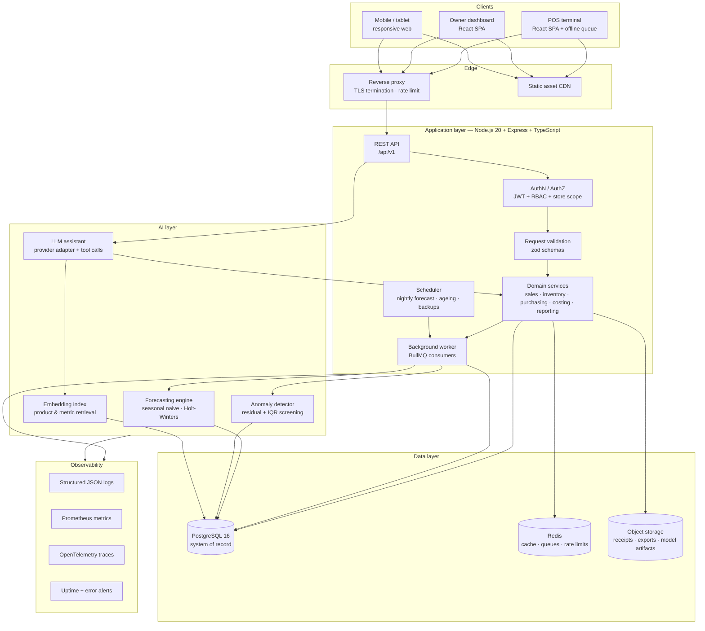
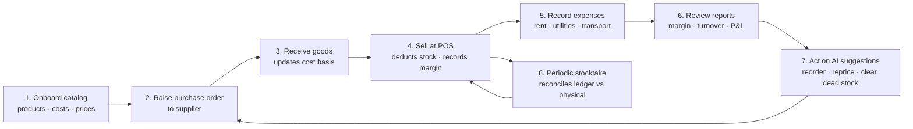
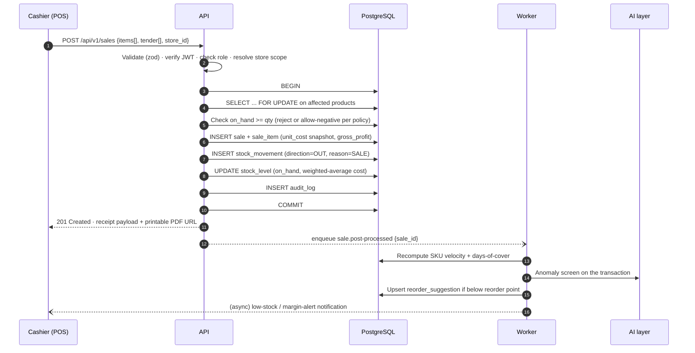
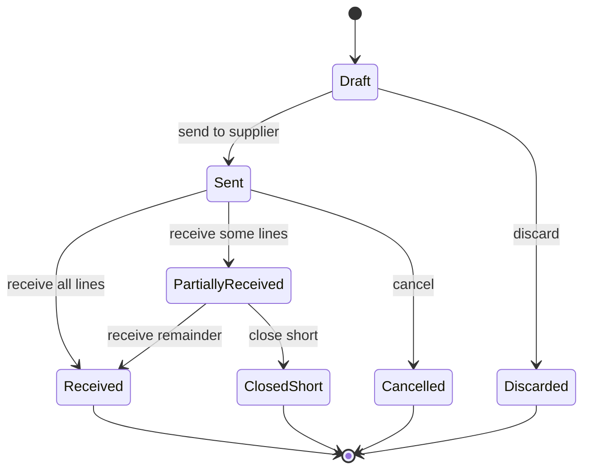
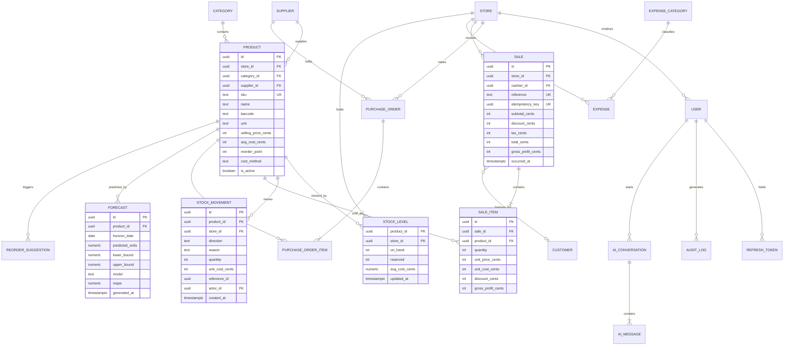
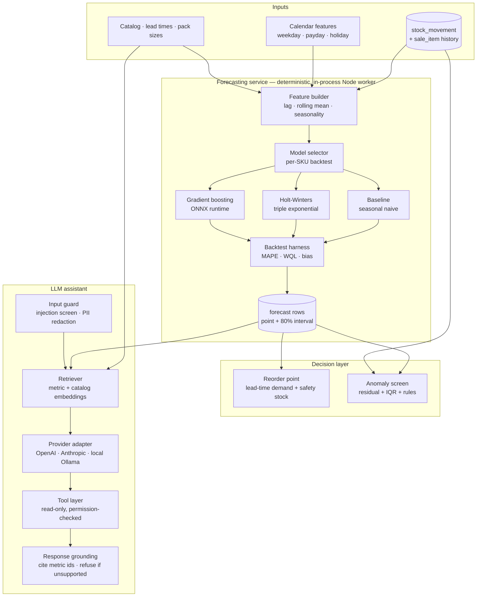
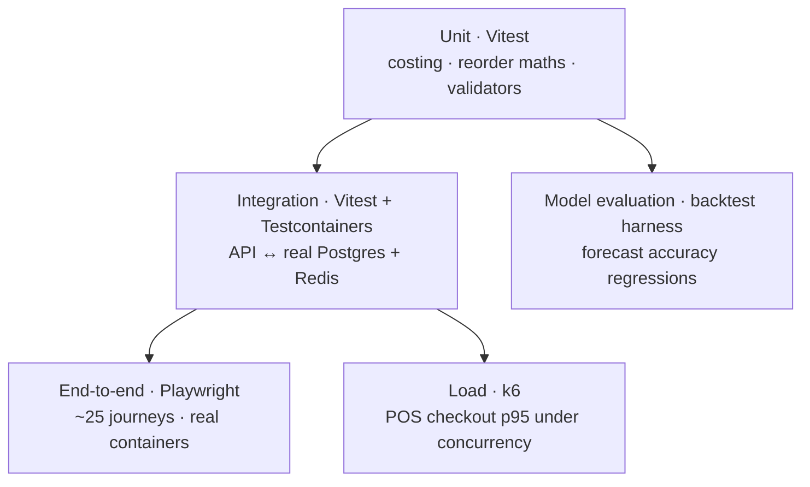
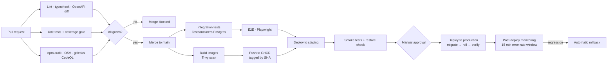

<div align="center">

# Inventory Management System

**Sales, stock and profitability intelligence for small-scale stores.**

A single-source-of-truth platform that tracks every unit in and out of a store, prices it
accurately at the moment of sale, and turns the resulting ledger into margin, turnover and
restock decisions the owner can act on the same day.


</div>

---

> ### 📌 Current state of this repository
>
> **The system is implemented and running.** This checkout contains a working
> TypeScript monorepo: an Express REST API, a React single-page app, an embedded
> PostgreSQL, a background job runner, the forecasting/reorder/anomaly layer and
> the assistant. It ships as a single executable — `node bin/ims.js start` boots
> the API and the web UI with no database server, no Redis and no Docker.
>
> ```bash
> pnpm install && pnpm build
> node bin/ims.js seed      # 38 SKUs, ~3,400 sales, 5 months of expenses
> node bin/ims.js start     # http://localhost:3000
> ```
>
> Sign in as `owner@demo.ims` / `Demo!Owner2026`.
>
> **Verified:** 61 automated tests pass (29 unit, 32 integration against a real
> PostgreSQL), `tsc --noEmit` is clean under `strict`, and both bundles build.
>
> **Two deliberate deviations from the original blueprint**, both driven by
> constraints found during implementation:
>
> | Planned | Shipped | Why |
> |---|---|---|
> | Prisma ORM | A thin SQL data layer with two drivers (`PGlite`, `pg`) | Prisma's query engine downloads from `binaries.prisma.sh` at install time, which is unreachable in restricted networks. The SQL layer has no such dependency. |
> | BullMQ on Redis | A durable `job_queue` table with an in-process poller | Removes a required service from a 2 vCPU single-machine install. The `Queue` interface is the swap point. |
>
> Every section still carries a status badge so intent is never confused with
> shipped behaviour.
>
> | Badge | Meaning |
> |---|---|
> |  | Implemented and covered by automated checks |
> |  | Core implemented, part of the spec still open |
> |  | Specified here, not yet implemented |

---

## Table of contents

1. [Rationale and Purpose](#1-rationale-and-purpose)
2. [Architecture diagram](#2-architecture-diagram)
3. [System workflow](#3-system-workflow)
4. [Feature list](#4-feature-list)
5. [API documentation](#5-api-documentation)
6. [Database schema](#6-database-schema)
7. [AI architecture](#7-ai-architecture)
8. [Security considerations](#8-security-considerations)
9. [Testing](#9-testing)
10. [Docker setup](#10-docker-setup)
11. [CI/CD](#11-cicd)
12. [Screenshots](#12-screenshots)
13. [Demo](#13-demo)

---

## 1. Rationale and Purpose


### The problem

Small-scale stores — sari-sari stores, neighbourhood groceries, hardware and farm-supply
outlets, campus canteens, mini-pharmacies — overwhelmingly run on paper notebooks, a
spreadsheet, or the owner's memory. That produces four concrete, measurable failures:

| Failure mode | What it costs the store |
|---|---|
| **Unknown true margin** | Prices are set against the *last* purchase price, not the cost of the units actually sold. Wholesale price movement silently erodes gross margin for weeks before anyone notices. |
| **Stock-outs on fast movers** | The best-selling SKUs run empty mid-week. Lost sales are invisible because an unrecorded sale leaves no trace. |
| **Cash trapped in slow movers** | Capital sits in items that have not moved in 90+ days, expiring or losing value, with no report surfacing it. |
| **No profitability picture** | Revenue is known; profit is not. Rent, utilities, transport and spoilage are paid from the till and never attributed to a period, so "how did this month go?" has no answer. |

Existing tools do not fit this segment: enterprise WMS/ERP suites are priced, configured and
staffed for warehouses, while consumer stock apps treat a store as a flat list of quantities
with no costing, no supplier ordering, and no profit reporting.

### Purpose

Provide a **low-cost, low-friction, offline-tolerant** system that gives a small-store owner:

1. **A complete stock ledger** — every unit in, out, returned, spoiled or counted, attributed
   to a user, a timestamp and a reason. Nothing is editable after the fact; corrections are
   made with reversing entries so the history stays auditable.
2. **Accurate, point-in-time profitability** — each sold line records the cost basis of the
   units consumed, so gross margin is a fact rather than an estimate, and net profit is gross
   margin minus the period's recorded operating expenses.
3. **Forward-looking replenishment** — demand forecasts and reorder-point suggestions generated
   from the store's own sales history, surfaced as a single actionable list.
4. **Answers in plain language** — an assistant the owner can ask ("which items lost money last
   week?", "what should I reorder before Friday?") without learning a reporting UI.

### Scope

| In scope | Out of scope (for now) |
|---|---|
| Products, categories, units, barcodes | Manufacturing / bill of materials |
| Suppliers, purchase orders, goods receiving | Full double-entry general ledger |
| POS sales, returns, receipts, tenders | Payroll, HR, tax filing |
| Stock adjustments, transfers, stocktakes | Warehouse robotics / conveyor integration |
| Operating expenses and period P&L | Multi-currency consolidation |
| Margin, turnover, ageing, dead-stock reporting | Marketplace / e-commerce storefront |
| Demand forecasting, reorder suggestions, anomaly detection | Hardware driver bundles (bundled later) |
| Single store, with multi-outlet ready in the schema | Franchise consolidation reporting |

### Non-functional requirements

| Requirement | Target | Rationale |
|---|---|---|
| POS checkout latency | p95 < 400 ms server-side | Queue length is the owner's primary pain |
| Availability | 99.5 % during trading hours | A store cannot stop selling |
| Offline tolerance | Sales queueable locally for ≥ 24 h, then synced | Connectivity in target regions is intermittent |
| Recovery point objective | ≤ 15 min | Nightly-plus-WAL backup |
| Recovery time objective | ≤ 1 h | Single-node restore from image + dump |
| Runs on | 2 vCPU / 4 GB VM, or a small on-prem box | Cost ceiling for the segment |
| Localisation | en, fil; currency `PHP` default, configurable | Primary market |

---

## 2. Architecture diagram


>
> **Shipped difference:** the diagram shows Prisma and BullMQ/Redis. The build
> uses a SQL data layer over PGlite/`pg` and a durable `job_queue` table instead;
> module boundaries are unchanged, so either can be swapped in later.

### 2.1 System context



### 2.2 Architectural decisions

| # | Decision | Alternatives considered | Why this one |
|---|---|---|---|
| 1 | **Modular monolith** (Express + typed service layer), not microservices | Service-per-domain | A 2 vCPU deployment budget and a two-person team cannot operate a fleet of services. Module boundaries (`sales`, `inventory`, `purchasing`, `reporting`, `ai`) are enforced by dependency rules so the worker and the AI layer can be split out later without a rewrite. |
| 2 | **Append-only `stock_movement` ledger** with a derived `stock_level` cache | Mutable quantity column | An editable quantity can never be reconciled after the fact. A ledger makes every balance recomputable, gives free audit history, and is the input the forecasters need. |
| 3 | **Cost basis snapshotted onto `sale_item`** | Recompute margin from current product cost | Wholesale prices move. Recomputing rewrites history and makes last month's report differ from what was reported last month. |
| 4 | **TypeScript end to end**, zod schemas shared by API and client | Untyped JS, or separate DTO layers | One schema definition produces runtime validation, static types and the OpenAPI document. Drift between client and server becomes a compile error. |
| 5 | **A thin SQL data layer** with two drivers behind one `Database` interface (`PGlite` embedded, `pg` for a server) | Prisma, TypeORM, Drizzle | Prisma's engine binary is fetched from `binaries.prisma.sh` at install time and fails on restricted networks. One interface means the same SQL runs on an embedded PostgreSQL during development and on PostgreSQL 16 in production, with parameterised queries throughout. |
| 6 | **BullMQ on Redis** for async work | In-process `setInterval`, cron in the container | Retries with backoff, visibility into failed jobs, and no duplicate work when the API is scaled past one replica. |
| 7 | **REST + OpenAPI**, not GraphQL | GraphQL | POS clients issue a small, fixed set of calls. OpenAPI gives contract tests and client codegen for free, with no resolver complexity. |
| 8 | **LLM behind an adapter with tool calls only** | Direct DB access from the model | Free-form SQL from a model is an unbounded read on data scoped by store and role. Tools are parameterised, allow-listed and permission-checked. |
| 9 | **Postgres as the single system of record**; Redis is disposable | Redis as a data store | Losing Redis must cost latency, not truth. |

### 2.3 Proposed repository layout

```text
inventory-management-system/
├── apps/
│   ├── api/                  # Express REST API + BullMQ worker (single image, two entrypoints)
│   │   ├── src/
│   │   │   ├── modules/
│   │   │   │   ├── auth/     # login, refresh, RBAC, store scoping
│   │   │   │   ├── catalog/  # products, categories, suppliers, barcodes
│   │   │   │   ├── inventory/# levels, movements, adjustments, stocktakes
│   │   │   │   ├── purchasing/
│   │   │   │   ├── sales/    # POS, returns, receipts, costing
│   │   │   │   ├── reporting/# margin, turnover, ageing, P&L
│   │   │   │   └── ai/       # forecasting, anomaly, assistant
│   │   │   ├── shared/       # errors, pagination, logging, transactions
│   │   │   └── main.ts
│   │   └── prisma/
│   │       ├── schema.prisma
│   │       ├── migrations/
│   │       └── seed.ts
│   └── web/                  # React 18 + Vite (POS + dashboard)
│       └── src/{features,components,lib}/
├── packages/
│   ├── contracts/            # zod schemas → shared types + OpenAPI (single source of truth)
│   └── config/               # shared eslint, tsconfig, prettier
├── tests/
│   ├── integration/          # Testcontainers Postgres
│   └── e2e/                  # Playwright
├── docs/
│   ├── adr/                  # architecture decision records
│   ├── screenshots/
│   └── api/openapi.yaml      # generated from packages/contracts
├── .github/workflows/
├── docker-compose.yml
└── README.md
```

---

## 3. System workflow


>
> **Shipped difference:** the checkout sequence, PO state machine, movement
> reason codes and profit formulas are all implemented. The stocktake session lock
> (blocking sales on counted SKUs) is not yet enforced.

### 3.1 End-to-end operating loop



The loop is deliberately closed: sales generate the history that drives forecasting, and
forecasting feeds the next purchase order.

### 3.2 Point-of-sale checkout (critical path)



**Offline path.** When the POS cannot reach the API it writes the sale to a local IndexedDB
queue with a client-generated idempotency key, then replays on reconnect. The API deduplicates
on `Idempotency-Key`, so a retry after an ambiguous timeout never double-sells stock.

### 3.3 Purchasing lifecycle



Receiving is the only place the **cost basis** changes: the received quantity and landed unit
cost (including allocated freight) update the product's moving weighted-average cost, and every
subsequent sale snapshots that new figure.

### 3.4 Stock movement semantics

Every change to on-hand quantity is one row in `stock_movement`. There is no other way to
change stock.

| Direction | Reason | Triggered by | Effect on cost basis |
|---|---|---|---|
| `IN` | `PURCHASE` | Goods receipt | Recomputes weighted average |
| `IN` | `RETURN_FROM_CUSTOMER` | Sales return | Restores the snapshotted cost |
| `IN` | `ADJUSTMENT_UP` | Stocktake surplus / found stock | Uses current average cost |
| `IN` | `TRANSFER_IN` | Inter-outlet transfer | Carries the sending cost |
| `OUT` | `SALE` | POS checkout | No change (consumption) |
| `OUT` | `SPOILAGE` / `DAMAGE` | Write-off | No change; value hits COGS |
| `OUT` | `ADJUSTMENT_DOWN` | Stocktake shortfall | No change; variance is costed |
| `OUT` | `TRANSFER_OUT` | Inter-outlet transfer | No change at source |

### 3.5 Profitability computation

```text
line_gross_profit   = (unit_price - unit_cost_snapshot) × quantity - line_discount
order_gross_profit  = Σ line_gross_profit
period_gross_profit = Σ order_gross_profit                       (period, store, category)
period_net_profit   = period_gross_profit - Σ allocated_expenses
gross_margin_pct    = period_gross_profit ÷ net_revenue
inventory_turnover  = COGS ÷ average_inventory_value
days_of_cover       = on_hand ÷ forecast_daily_demand
```

Expenses are allocated to a period by date, and optionally split across outlets by a
configurable driver (revenue share, floor area, or headcount).

---

## 4. Feature list


>
> **Shipped:** all P0 items except `POS-06` shift reconciliation, `INV-06`
> transfers, `RPT-10` exports and `PLT-07` webhooks. P1/P2 items are not built.

Legend: **P0** launch-blocking · **P1** first release after launch · **P2** later.

### 4.1 Catalog

| ID | Feature | Priority | Notes |
|---|---|---|---|
| CAT-01 | Product CRUD with SKU, barcode, unit, brand | P0 | Barcode lookup by scanner or camera |
| CAT-02 | Category tree (2 levels) | P0 | Drives margin roll-ups |
| CAT-03 | Cost price, selling price, tax rate per product | P0 | Tax-inclusive and tax-exclusive modes |
| CAT-04 | Costing method per product (moving average default) | P0 | FIFO and last-cost available |
| CAT-05 | CSV import / export with validation report | P0 | The onboarding path for existing stores |
| CAT-06 | Low-stock thresholds, reorder point, pack size | P0 | Feeds AI suggestions |
| CAT-07 | Product images and notes | P1 | Object storage |
| CAT-08 | Price lists / promotions (time-boxed, per category) | P1 | Margin impact shown before save |
| CAT-09 | Composite / bundled items | P2 | Explodes to components on sale |

### 4.2 Inventory

| ID | Feature | Priority | Notes |
|---|---|---|---|
| INV-01 | Live on-hand per product per outlet | P0 | Derived from the ledger |
| INV-02 | Append-only stock ledger with reason codes | P0 | Immutable; corrections reverse |
| INV-03 | Manual adjustments with mandatory reason + approver | P0 | Every adjustment is auditable |
| INV-04 | Stocktake sessions (count sheets, variance, approval) | P0 | Freezes the counted SKUs |
| INV-05 | Low-stock and out-of-stock dashboard | P0 | Sorted by revenue at risk |
| INV-06 | Inter-outlet transfers | P1 | Two-sided ledger entries |
| INV-07 | Batch / expiry tracking | P1 | Required for food and pharma |
| INV-08 | Inventory valuation report (at cost, at retail) | P0 | Month-end figure |
| INV-09 | Barcode label printing | P2 | Thermal printer support |

### 4.3 Point of sale

| ID | Feature | Priority | Notes |
|---|---|---|---|
| POS-01 | Barcode and search-based cart entry | P0 | Keyboard-first, touch-friendly |
| POS-02 | Line and order discounts, with margin floor warning | P0 | Blocks below-cost sales unless overridden |
| POS-03 | Multiple tenders per sale (cash, e-wallet, card, credit) | P0 | Credit creates a customer balance |
| POS-04 | Receipt printing (thermal) and PDF | P0 | 58 mm / 80 mm templates |
| POS-05 | Returns and voids with stock restoration | P0 | Restores the original cost basis |
| POS-06 | Shift open/close with cash reconciliation | P0 | Expected vs counted, variance recorded |
| POS-07 | Offline sale queue with conflict-safe sync | P0 | Idempotency-keyed replay |
| POS-08 | Held carts and multiple concurrent tabs | P1 | |
| POS-09 | Customer-facing display mode | P2 | |

### 4.4 Purchasing

| ID | Feature | Priority | Notes |
|---|---|---|---|
| PUR-01 | Supplier records with terms and lead time | P0 | Lead time feeds reorder point |
| PUR-02 | Purchase order drafting from reorder suggestions | P0 | One click from the AI list |
| PUR-03 | Partial receiving and short-close | P0 | Drives the PO state machine |
| PUR-04 | Landed cost allocation (freight, duties) | P1 | Allocates by value or weight |
| PUR-05 | Supplier price history and price-change alerts | P1 | Protects margin from silent cost creep |

### 4.5 Reporting and profitability

| ID | Feature | Priority | Notes |
|---|---|---|---|
| RPT-01 | Dashboard: today's sales, gross margin, top movers, alerts | P0 | Sub-second, cached |
| RPT-02 | Sales summary by day / week / month / custom range | P0 | |
| RPT-03 | Profit & loss for a period (gross → net) | P0 | Includes recorded expenses |
| RPT-04 | Product performance: revenue, margin %, units, velocity | P0 | |
| RPT-05 | Dead-stock and ageing report (30/60/90/180 days) | P0 | With capital tied up |
| RPT-06 | Inventory turnover and days-of-cover | P0 | |
| RPT-07 | Expense tracking by category with recurring entries | P0 | |
| RPT-08 | Cashier performance and void/return rates | P1 | |
| RPT-09 | Scheduled email / chat reports (daily, weekly) | P1 | |
| RPT-10 | Export to CSV / XLSX / PDF | P0 | |

### 4.6 Intelligence

| ID | Feature | Priority | Notes |
|---|---|---|---|
| AI-01 | Per-SKU demand forecast (7/14/28-day horizons) | P0 | See [§7](#7-ai-architecture) |
| AI-02 | Reorder-point and suggested-order-quantity list | P0 | Actionable, one click to PO |
| AI-03 | Sales and stock anomaly alerts | P0 | Shrinkage and keying-error screening |
| AI-04 | Natural-language assistant over store data | P0 | Read-only tools only |
| AI-05 | Margin erosion and price-change recommendations | P1 | |
| AI-06 | Plain-language daily summary ("what happened today") | P1 | |
| AI-07 | Seasonality insights and category trends | P2 | |

### 4.7 Platform

| ID | Feature | Priority | Notes |
|---|---|---|---|
| PLT-01 | Role-based access: Owner, Manager, Cashier, Viewer | P0 | See [§8.3](#83-authorization) |
| PLT-02 | Multi-outlet support in schema and queries | P0 | One outlet enabled at launch |
| PLT-03 | Full audit log with actor, entity, before/after | P0 | |
| PLT-04 | Localised UI (en, fil) and configurable currency | P0 | `PHP` default |
| PLT-05 | Daily automated backup + point-in-time WAL archive | P0 | |
| PLT-06 | REST API with OpenAPI document and API keys | P0 | |
| PLT-07 | Webhooks for sale / low-stock events | P2 | |
| PLT-08 | Self-service restore and health endpoints | P0 | `/healthz`, `/readyz` |

---

## 5. API documentation


>
> **Shipped:** every endpoint below except CSV import/export, transfers,
> `/shifts/*`, `/reports/export`, `PATCH /users/{id}` and message feedback. `/ai/chat`
> returns JSON rather than an SSE stream.

> The OpenAPI 3.1 document will be **generated from the shared zod schemas** in
> `packages/contracts` and published at `/api/v1/openapi.json`, with interactive docs at
> `/api/docs`. The tables below are the normative contract; generated docs must never diverge
> from them.

### 5.1 Conventions

| Aspect | Convention |
|---|---|
| Base URL | `https://{host}/api/v1` |
| Format | JSON request and response bodies, UTF-8 |
| Auth | `Authorization: Bearer <access_token>` (short-lived JWT, 15 min) |
| Refresh | Cookie `HttpOnly` refresh token (30 d, rotating) at `/api/v1/auth/refresh` |
| Idempotency | `Idempotency-Key: <uuid>` on all `POST` that mutate stock or money |
| Tenancy | `X-Store-Id` header; validated against the caller's grants |
| Pagination | `?page=1&per_page=50` (max 200); ledger endpoints use `?cursor=` |
| Sorting | `?sort=-created_at` (`-` prefix for descending) |
| Filtering | `?q=` free text plus typed filters, e.g. `?category_id=&low_stock=true` |
| Time | ISO-8601 UTC on the wire; client renders in the store timezone |
| Money | Integer **centavos** in transit — never floats |
| Versioning | URI path segment; additive changes only within a major version |

### 5.2 Response envelopes

Success (collection):

```json
{
  "data": [ { "id": "01J8ZK...", "sku": "RC-1KG", "on_hand": 42 } ],
  "meta": { "page": 1, "per_page": 50, "total": 318, "total_pages": 7 }
}
```

Success (single resource) returns the object under `data`. Errors always use one shape:

```json
{
  "error": {
    "code": "INSUFFICIENT_STOCK",
    "message": "Not enough on-hand stock for SKU RC-1KG.",
    "details": [
      { "field": "items[0].quantity", "requested": 5, "available": 2, "sku": "RC-1KG" }
    ],
    "request_id": "req_01J8ZK9T2Q"
  }
}
```

| HTTP status | Codes |
|---|---|
| 400 | `VALIDATION_FAILED` |
| 401 | `UNAUTHENTICATED`, `TOKEN_EXPIRED`, `REFRESH_TOKEN_REUSED` |
| 403 | `FORBIDDEN`, `STORE_ACCESS_DENIED` |
| 404 | `NOT_FOUND` |
| 409 | `CONFLICT`, `IDEMPOTENCY_KEY_REPLAY`, `STOCKTAKE_IN_PROGRESS` |
| 422 | `INSUFFICIENT_STOCK`, `BELOW_COST_PRICE`, `INVALID_STATE_TRANSITION` |
| 429 | `RATE_LIMITED` |
| 500 | `INTERNAL_ERROR` (message is generic; `request_id` links to logs) |

### 5.3 Endpoints

#### Authentication and users

| Method | Path | Role | Description |
|---|---|---|---|
| POST | `/auth/login` | public | Exchange credentials for access + refresh tokens |
| POST | `/auth/refresh` | cookie | Rotate refresh token, issue access token |
| POST | `/auth/logout` | any | Revoke the current refresh token family |
| POST | `/auth/password` | any | Change own password (requires current) |
| GET | `/users` | Owner, Manager | List users |
| POST | `/users` | Owner | Invite a user with a role and outlet grants |
| PATCH | `/users/{id}` | Owner | Change role, outlets, or active state |
| GET | `/users/me` | any | Current identity, role, grants |

#### Catalog

| Method | Path | Role | Description |
|---|---|---|---|
| GET | `/products` | any | List, filter, search, paginate |
| POST | `/products` | Manager+ | Create product |
| GET | `/products/{id}` | any | Product with current level and cost basis |
| PATCH | `/products/{id}` | Manager+ | Update fields |
| DELETE | `/products/{id}` | Manager+ | Soft delete (blocked if stock or history exists) |
| GET | `/products/barcode/{code}` | any | Barcode lookup — the hot POS path |
| GET | `/products/{id}/ledger` | Manager+ | Cursor-paginated stock movements |
| POST | `/products/import` | Manager+ | CSV import; returns per-row validation report |
| GET | `/products/export` | Manager+ | CSV / XLSX download |
| GET / POST / PATCH | `/categories` | Manager+ | Category tree |
| GET / POST / PATCH | `/suppliers` | Manager+ | Suppliers and terms |

#### Inventory

| Method | Path | Role | Description |
|---|---|---|---|
| GET | `/inventory/levels` | any | On-hand per product per outlet, with valuation |
| GET | `/inventory/low-stock` | any | Below reorder point, ranked by revenue at risk |
| POST | `/inventory/adjustments` | Manager+ | Adjustment with mandatory reason code |
| GET | `/inventory/adjustments` | Manager+ | Adjustment history |
| POST | `/inventory/stocktakes` | Manager+ | Open a count session (freezes counted SKUs) |
| GET | `/inventory/stocktakes/{id}` | Manager+ | Session with per-line variance |
| POST | `/inventory/stocktakes/{id}/complete` | Owner, Manager | Post variances as adjustments |
| POST | `/inventory/transfers` | Manager+ | Move stock between outlets |
| GET | `/inventory/valuation` | Manager+ | Value at cost and at retail |

#### Purchasing

| Method | Path | Role | Description |
|---|---|---|---|
| GET / POST | `/purchase-orders` | Manager+ | List / draft a purchase order |
| GET | `/purchase-orders/{id}` | Manager+ | Order with lines and receipt history |
| PATCH | `/purchase-orders/{id}` | Manager+ | Edit while `Draft` |
| POST | `/purchase-orders/{id}/send` | Manager+ | `Draft → Sent` |
| POST | `/purchase-orders/{id}/receive` | Manager+ | Receive lines; updates cost basis |
| POST | `/purchase-orders/{id}/close` | Manager+ | Close short |
| POST | `/purchase-orders/{id}/cancel` | Manager+ | Cancel while unreceived |

#### Sales

| Method | Path | Role | Description |
|---|---|---|---|
| POST | `/sales` | Cashier+ | Create a sale (idempotent) |
| GET | `/sales` | Manager+ | List with date, cashier, tender filters |
| GET | `/sales/{id}` | Cashier+ | Sale with lines and cost snapshot |
| GET | `/sales/{id}/receipt` | Cashier+ | Printable receipt (JSON, PDF or thermal payload) |
| POST | `/sales/{id}/return` | Cashier+ | Return lines; restores stock at original cost |
| POST | `/sales/{id}/void` | Manager+ | Void with mandatory reason; writes reversing entries |
| POST | `/shifts/open` · `/shifts/close` | Cashier+ | Shift with expected vs counted cash |

#### Reporting

| Method | Path | Role | Description |
|---|---|---|---|
| GET | `/reports/dashboard` | any | Today's headline numbers and alerts |
| GET | `/reports/sales-summary` | Manager+ | Grouped by `day`, `week`, `month`, or range |
| GET | `/reports/profit-loss` | Owner, Manager | Gross → net for a period |
| GET | `/reports/product-performance` | Manager+ | Revenue, margin %, units, velocity |
| GET | `/reports/inventory-ageing` | Manager+ | 30/60/90/180-day buckets with capital tied up |
| GET | `/reports/turnover` | Manager+ | Turnover and days-of-cover |
| GET / POST | `/expenses` | Manager+ | Operating expenses |
| GET | `/reports/export` | Manager+ | CSV / XLSX / PDF of any report |

All report endpoints accept `from`, `to`, `store_id`, `category_id`, and `format=json|csv`.

#### AI

| Method | Path | Role | Description |
|---|---|---|---|
| GET | `/ai/forecasts` | Manager+ | Latest forecasts; filters by SKU, category, horizon |
| POST | `/ai/forecasts/run` | Manager+ | Enqueue a forecast job (returns `202` + job id) |
| GET | `/ai/forecasts/jobs/{id}` | Manager+ | Job status and metrics |
| GET | `/ai/reorder-suggestions` | Manager+ | Ranked, actionable restock list |
| POST | `/ai/reorder-suggestions/to-purchase-order` | Manager+ | Convert a selection into a draft PO |
| GET | `/ai/anomalies` | Manager+ | Flagged transactions and movements |
| POST | `/ai/anomalies/{id}/resolve` | Manager+ | Mark investigated with a note |
| POST | `/ai/chat` | Manager+ | Streaming (SSE) assistant turn with tool calls |
| GET | `/ai/conversations` · `/ai/conversations/{id}` | Manager+ | Conversation history |
| POST | `/ai/messages/{id}/feedback` | Manager+ | 👍 / 👎 plus optional correction text |

#### Platform

`/healthz` and `/readyz` are served at the **host root** (not under `/api/v1`) so load balancers
can probe them without the version prefix. Everything else in this table is relative to the base
URL.

| Method | Path | Auth | Description |
|---|---|---|---|
| GET | `/healthz` (host root) | none | Liveness |
| GET | `/readyz` (host root) | none | Readiness — checks DB, Redis, migrations |
| GET | `/meta` | any | Server version, schema revision, feature flags |
| GET | `/audit-logs` | Owner | Cursor-paginated audit trail |
| GET | `/openapi.json` | none | Machine-readable contract |

### 5.4 Worked example — checkout

`POST /api/v1/sales`

```http
Authorization: Bearer eyJhbGciOi...
X-Store-Id: 01J8ZH0STORE
Idempotency-Key: 6f1c1d5e-1a2b-4c3d-9e4f-0a1b2c3d4e5f
Content-Type: application/json
```

```json
{
  "cashier_id": "01J8ZH0CASHIER",
  "occurred_at": "2026-09-21T06:14:02Z",
  "items": [
    { "product_id": "01J8ZH0PROD1", "quantity": 2, "unit_price_cents": 5800, "discount_cents": 0 },
    { "product_id": "01J8ZH0PROD2", "quantity": 1, "unit_price_cents": 12500, "discount_cents": 500 }
  ],
  "tenders": [ { "method": "CASH", "amount_cents": 26432 } ],
  "customer_id": null,
  "note": null
}
```

`201 Created`

```json
{
  "data": {
    "id": "01J8ZH0SALE",
    "reference": "S-2026-000418",
    "store_id": "01J8ZH0STORE",
    "occurred_at": "2026-09-21T06:14:02Z",
    "subtotal_cents": 24100,
    "discount_cents": 500,
    "net_revenue_cents": 23600,
    "tax_cents": 2832,
    "total_cents": 26432,
    "gross_profit_cents": 3680,
    "gross_margin_pct": 15.6,
    "lines": [
      {
        "product_id": "01J8ZH0PROD1",
        "sku": "RC-1KG",
        "name": "Rice, 1 kg",
        "quantity": 2,
        "unit_price_cents": 5800,
        "unit_cost_cents": 4750,
        "gross_profit_cents": 2100
      },
      {
        "product_id": "01J8ZH0PROD2",
        "sku": "CO-330ML",
        "name": "Cooking oil, 330 ml",
        "quantity": 1,
        "unit_price_cents": 12500,
        "unit_cost_cents": 10420,
        "discount_cents": 500,
        "gross_profit_cents": 1580
      }
    ],
    "receipt_url": "/api/v1/sales/01J8ZH0SALE/receipt?format=pdf"
  }
}
```

The figures above follow the formulas in [§3.5](#35-profitability-computation) exactly, and are
asserted by the integration suite:

```text
net_revenue   = 24100 - 500                                  = 23600
line 1 gross  = (5800 - 4750) × 2 - 0                        =  2100
line 2 gross  = (12500 - 10420) × 1 - 500                    =  1580
order gross   = 2100 + 1580                                  =  3680
gross_margin  = 3680 ÷ 23600                                 =  15.6 %
tax           = 12 % of net_revenue (tax-exclusive mode)     =  2832
total         = 23600 + 2832                                 = 26432  == Σ tenders
```

Note that `unit_cost_cents` on each line is the product's moving weighted-average cost **at the
moment of sale**; it is written once and never recomputed, which is what keeps this month's
report identical next month.

### 5.5 Rate limits

| Bucket | Limit | Rationale |
|---|---|---|
| `/auth/login` | 5 / min / IP + account | Credential stuffing defence |
| POS write paths (`/sales`, `/inventory/*`) | 120 / min / token | Realistic cashier throughput with headroom |
| Report endpoints | 30 / min / token | These are the expensive aggregations |
| `/ai/chat` | 20 / min / token, 200 k tokens / day / store | Cost control |
| Everything else | 300 / min / token | |

Responses carry `RateLimit-Limit`, `RateLimit-Remaining` and `RateLimit-Reset`.

---

## 6. Database schema


>
> **Shipped:** 22 of the tables below. Not yet modelled: `product_price_history`,
> `outbox`, and shift reconciliation.

Engine **PostgreSQL 16** in production; the embedded development database is PGlite, which
reports `PostgreSQL 18.3 (PGlite 0.5.8)`. Migrations are plain SQL files in
`apps/api/src/db/migrations/`, applied forward-only by `src/db/migrate.ts`, each inside its own
transaction and recorded in the `migration` table. The shipped schema matches the model below;
the only difference from this specification is that shift reconciliation (`POS-06`) is not yet
modelled.

### 6.1 Entity relationship diagram



### 6.2 Table inventory

| Table | Purpose | Notable constraints |
|---|---|---|
| `store` | Outlet; tenancy root for all operational data | Unique `code` |
| `user` | Staff and owners | Unique `email`; `password_hash` never leaves the API layer |
| `role_grant` | User × store × role | Prevents privilege escalation across outlets |
| `refresh_token` | Rotating refresh token families | `family_id` + `revoked_at` enables reuse detection |
| `category` | Two-level product hierarchy | `parent_id` self-reference, depth ≤ 2 |
| `supplier` | Vendor, terms, lead time | `lead_time_days` feeds reorder point |
| `product` | Sellable unit | Unique `(store_id, sku)`; soft delete via `deleted_at` |
| `product_price_history` | Every price change with effective date | Append-only |
| `stock_level` | **Derived** current on-hand and average cost | PK `(product_id, store_id)`; recomputable from ledger |
| `stock_movement` | **Append-only** stock ledger | No `UPDATE`/`DELETE`; `CHECK (quantity > 0)` |
| `stocktake` / `stocktake_line` | Physical count sessions and variance | Session lock blocks sales on counted SKUs |
| `purchase_order` / `purchase_order_item` | Supplier orders and received quantities | `status` guarded by the §3.3 state machine |
| `sale` | POS transaction header | Unique `idempotency_key`; `CHECK (total_cents >= 0)` |
| `sale_item` | POS line with **cost snapshot** | `unit_cost_cents` immutable after insert |
| `payment` | Tender lines per sale | `Σ payment = sale.total_cents` enforced in service + trigger |
| `customer` | Optional buyer record and credit balance | PII is minimised and encrypted at rest |
| `expense` / `expense_category` | Operating costs for net profit | Allocated to a period by `incurred_on` |
| `forecast` | Per-SKU predictions with intervals and model score | Unique `(product_id, horizon_date, model, generated_at)` |
| `reorder_suggestion` | Ranked restock recommendations | Lifecycle `suggested → accepted → ordered → dismissed` |
| `anomaly` | Flagged transactions or movements | Requires resolution note to close |
| `ai_conversation` / `ai_message` | Assistant transcripts and tool-call audit | Redacted before persistence |
| `audit_log` | Actor, entity, action, before/after JSONB | Append-only, indexed by `(entity, entity_id)` |
| `outbox` | Transactional event publishing | Guarantees at-least-once delivery to workers |

### 6.3 Design rules

1. **Money is an integer number of centavos** (`bigint`), never `float`/`double`. Only rates,
   ratios and forecast quantities use `numeric`.
2. **`stock_level` is a cache.** It is recomputed from `stock_movement` by a verified SQL
   function, and a nightly job asserts `SUM(ledger) == stock_level.on_hand` for every SKU. Any
   mismatch raises an alert — the ledger always wins.
3. **Immutability of financial history.** `sale`, `sale_item` and `stock_movement` are never
   updated. Corrections are new rows with reversing quantities and a `corrects_id` reference.
4. **Every operational row carries `store_id`** and every read is filtered by it at the
   repository layer, so cross-outlet leakage requires a code change, not just a bad parameter.
5. **Soft delete** (`deleted_at`) for catalogue entities; hard delete is never used where
   history references the row.
6. **UUIDv7 primary keys** — time-ordered, so index inserts stay append-friendly and ids leak
   no enumeration information.
7. **JSONB only for shapeless audit payloads**, never for queryable business data.

### 6.4 Indexes

| Index | Serves |
|---|---|
| `sale (store_id, occurred_at DESC)` | Date-range sales and dashboard queries |
| `sale_item (product_id, sale_id)` | Product performance and velocity |
| `stock_movement (product_id, store_id, created_at DESC)` | Ledger paging and velocity windows |
| `stock_movement (reason, created_at)` | Shrinkage and adjustment reports |
| `product (store_id, sku)` unique, `product (barcode)` | POS lookups — the hottest path |
| `audit_log (entity, entity_id, created_at DESC)` | Entity history views |
| `expense (store_id, incurred_on)` | Period P&L |
| GIN on `audit_log.changes` | Ad-hoc audit searches |

### 6.5 Seeded reference data

`apps/api/prisma/seed.ts` provides: one demo store, four users (one per role), ~180 SKUs across
six categories, two suppliers, 18 months of synthetic daily sales with weekday and month-end
seasonality plus injected anomalies, and 12 months of expenses — enough for the forecasting and
reporting layers to be demonstrated meaningfully on a fresh database.

---

## 7. AI architecture


>
> **Shipped:** forecasting with backtested model selection, reorder-point maths,
> the anomaly rules and the assistant with a read-only, permission-checked tool
> layer and PII redaction. The provider is the deterministic local one; the
> OpenAI/Anthropic adapters, embedding retrieval and SSE streaming are not built.

Two independent subsystems share the store's data but not their failure modes. A forecasting
failure degrades suggestion quality; an LLM failure removes a convenience feature. Neither is
allowed to block a sale.



### 7.1 Demand forecasting

| Aspect | Design |
|---|---|
| Granularity | Per SKU per outlet, daily buckets |
| Horizons | 7, 14 and 28 days ahead |
| Minimum history | 56 days; below that, fall back to category-level pooled demand |
| Candidate models | Seasonal-naive baseline (always run, always reported), Holt-Winters triple exponential smoothing with weekday seasonality, gradient-boosted trees served through ONNX Runtime for Node |
| Selection | Expanding-window backtest per SKU over the last 12 weeks; lowest weighted quantile loss wins; the baseline is used unless a model beats it by a material margin |
| Output | Point forecast plus an 80 % prediction interval, the chosen model name, and its backtest MAPE, persisted so every recommendation is explainable |
| Cold start | New SKUs inherit the category's seasonal shape scaled by their first week of sales |
| Intermittent demand | SKUs with > 60 % zero-demand days are routed to a Croston-style estimator instead of a smoothing model |
| Refresh | Nightly for all active SKUs; on-demand per SKU after a stocktake |
| Determinism | Fixed seeds, pinned model artifacts with checksums, and the input feature snapshot hash stored on each `forecast` row — a forecast is reproducible |
| Optional adapter | A Python/Prophet sidecar can be registered behind the same `ForecastModel` interface for stores with strong seasonal patterns; it is not required at launch |

**Reorder point and order quantity**

```text
lead_time_demand = mean_daily_demand(forecast) × supplier.lead_time_days
safety_stock     = z(0.95) × std_dev(daily_demand) × sqrt(lead_time_days)
reorder_point    = ceil(lead_time_demand + safety_stock)
suggested_qty    = round_up_to_pack_size(max(0, reorder_point + target_cover_days×demand - on_hand - on_order))
```

A suggestion is suppressed when the SKU is discontinued, on hold, inside an open stocktake, or
already on an unreceived purchase order — the last of these is what stops the classic
double-ordering bug.

### 7.2 Anomaly detection

Cheap, explainable and always-on, because unexplained stock loss is the single most expensive
silent failure in a small store.

| Signal | Rule | Typical cause surfaced |
|---|---|---|
| Forecast residual | Actual vs predicted outside the 99th percentile of the backtest residual distribution | Sudden unexplained drop (shrinkage) or spike |
| Negative or zero-margin sale | `unit_price <= unit_cost` | Keying error, unauthorised discount |
| Discount outlier | Line discount > 3 σ of that cashier's history | Discount abuse |
| Adjustment spike | Adjustment value > 95th percentile for the outlet | Unrecorded breakage or theft |
| Void / return clustering | > n voids per cashier per shift | Till manipulation |
| Velocity break | 7-day velocity < 40 % of the trailing 28-day mean without a stock-out | Data entry or listing error |
| Cost creep | Supplier unit cost up > 10 % without a price change | Margin erosion |

Each finding is written to `anomaly` with the triggering metric, its threshold and the observed
value, and must be closed with a resolution note. **No anomaly action is taken automatically** —
the system flags, the owner decides.

### 7.3 LLM assistant

| Concern | Design |
|---|---|
| Interface | `POST /api/v1/ai/chat` streamed over SSE; one assistant turn per request |
| Providers | Adapter interface with OpenAI, Anthropic and a local Ollama backend; the active provider is a deployment-time setting, so an air-gapped store can run fully on-device |
| Model choice | Small model for tool routing, larger model for synthesis; configurable per environment |
| Data access | **Tool calls only** — see the allow-list below. The model never receives credentials, never sees raw SQL, and never receives a database connection |
| Retrieval | Embeddings over product metadata, report definitions and metric descriptions; top-k injected with source ids |
| Grounding | Every numeric claim in a reply must reference a tool result id. Ungrounded numeric claims are stripped and the model is asked to re-answer or to say it does not know |
| Write actions | **None.** The assistant cannot create, update or delete anything. The only state-changing affordance is returning a deep link the user must confirm in the UI |
| Scope enforcement | Tool execution re-checks the caller's role and store grants server-side; the model cannot widen its own scope by asking for a different `store_id` |
| Prompt-injection defence | Untrusted text (product names, notes, CSV imports) is passed as data in a structured block, never concatenated into instructions; tool results are schema-validated before re-entry; instructions that appear inside retrieved content are ignored by design |
| PII | Customer names, phone numbers and payment data are redacted before the request leaves the process; transcripts are stored redacted |
| Guardrails | Input and output length caps, per-store daily token budget, hard timeout, circuit breaker that degrades to a static "assistant unavailable" state, and refusal on out-of-domain requests |
| Cost control | Response caching keyed on (question, store, data snapshot), truncation of long tool results, and a daily spend ceiling per store |
| Observability | Every turn logs prompt tokens, completion tokens, tools invoked, latency and provider — attributed to the store |
| Evaluation | A frozen question set with rubric-scored expected answers runs in CI on every prompt or tool change; a regression below the recorded baseline fails the build |
| Human feedback | 👍 / 👎 with optional correction text on every answer; stored against the turn and reviewed weekly |

**Tool allow-list** (all read-only, all permission-checked):

| Tool | Returns |
|---|---|
| `get_sales_summary(from, to, group_by)` | Revenue, units, margin for the period |
| `get_product_performance(product_ids?, sort, limit)` | Per-SKU revenue, margin %, velocity |
| `get_inventory_levels(product_ids?, low_stock?)` | On-hand, value, days of cover |
| `get_profit_loss(from, to)` | Gross → net with expense breakdown |
| `get_inventory_ageing(bucket)` | Ageing buckets and capital tied up |
| `get_forecast(product_ids?, horizon)` | Latest forecast and interval |
| `get_reorder_suggestions(limit)` | Ranked restock list |
| `get_anomalies(from, to, unresolved_only)` | Flagged events |
| `lookup_product(query)` | Product resolution by name, SKU or barcode |

### 7.4 AI failure policy

| Failure | Behaviour |
|---|---|
| Forecast job fails | Last good forecast is retained and marked stale after 7 days; suggestions show a staleness warning; job retries with backoff, then alerts |
| Backtest score degrades | Automatic fallback to the seasonal-naive baseline for that SKU |
| LLM provider unavailable | Circuit breaker opens; chat returns a graceful unavailable state; all non-AI features are unaffected |
| Tool returns an error | The model is told the tool failed and must not invent a number |
| Token budget exhausted | Chat disabled for the remainder of the day for that store; owners see why |

### 7.5 Model governance

- Model artifacts are versioned in object storage with checksums; the running version is
  reported by `/api/v1/meta`.
- Training data never leaves the deployment; providers receive only aggregated, redacted
  context.
- A model card per artifact records training window, features, metrics, known limitations and
  the date of the last evaluation.
- Every AI-generated number shown in the UI is clickable through to the report that produced it.
  **No unexplainable figure reaches an owner.**

---

## 8. Security considerations


>
> **Shipped:** Argon2id, RS256 access tokens with rotating refresh families and
> reuse detection, RBAC, repository-level store scoping, zod validation, security
> headers, rate limiting, append-only audit log, secret scanning in CI. Not yet:
> TOTP, automated backup/restore drills, image scanning with Trivy.

### 8.1 Threat model summary

| Threat | Actor | Primary controls |
|---|---|---|
| Credential stuffing / password guessing | External | Argon2id, per-account + per-IP rate limits, lockout with backoff, optional TOTP |
| Session hijacking | External | Short-lived access tokens, `HttpOnly` + `Secure` + `SameSite=Lax` refresh cookies, TLS everywhere, token revocation on logout |
| Refresh token theft and replay | External | Rotating families; reuse of a rotated token revokes the entire family and forces re-authentication |
| Horizontal privilege escalation (other store's data) | Insider | `store_id` on every query at the repository layer; grants checked server-side, never trusted from the client |
| Vertical escalation (cashier → owner actions) | Insider | RBAC on every route, asserted in integration tests for each endpoint |
| Till manipulation (voids, discounts, false returns) | Insider | Mandatory reasons, manager approval thresholds, per-cashier anomaly detection, immutable audit log |
| SQL injection | External | Prisma parameterised queries; raw SQL only through tagged templates with bound parameters |
| Cross-site scripting | External | React auto-escaping, strict CSP, no `dangerouslySetInnerHTML` without sanitisation, output encoding on receipts |
| CSRF | External | `SameSite` cookies plus an origin check on state-changing requests; POS uses bearer tokens |
| CSV import as an attack vector | External | Imports are parsed as data only; formulas are neutralised on export (`=`, `+`, `-`, `@` prefixed cells) to prevent CSV injection in spreadsheet clients |
| Prompt injection via product data | External | Untrusted text isolated as data, tool results schema-validated, no write tools (see [§7.3](#73-llm-assistant)) |
| Dependency compromise | Supply chain | Lockfiles, Dependabot/Renovate, `npm audit` and OSV scanning in CI, pinned base image digests |
| Ransomware / data loss | External | Off-instance encrypted backups, WAL archiving, tested restores, least-privilege DB role for the app |

### 8.2 Authentication

- Passwords hashed with **Argon2id** (memory-hard), per-user salt; minimum length 10 with
  breach-list checking; no composition rules that push users to predictable patterns.
- **Access token**: JWT, 15-minute lifetime, `RS256`, claims limited to `sub`, `role_grants`,
  `store_id`, `iat`, `exp`, `jti`. Keys are rotated with an overlap window and published via
  JWKS so verification never requires a database lookup.
- **Refresh token**: opaque, 30 days, rotating, stored hashed, family-tracked for reuse
  detection.
- Failed-login and password-reset endpoints are rate limited and emit identical responses for
  unknown accounts and wrong passwords to avoid account enumeration.
- Optional TOTP second factor for Owner and Manager roles; required in production once
  implemented.
- All secrets come from the environment or a secret manager. **No secret, key or token is ever
  committed**, and `.env` files are git-ignored with committed `.env.example` templates.

### 8.3 Authorization

| Role | Catalog | Stock | Sales | Returns / voids | Purchasing | Expenses | Reports | AI | Users / audit |
|---|---|---|---|---|---|---|---|---|---|
| **Owner** | full | full | ✓ | full | full | full | all | ✓ | ✓ |
| **Manager** | full | full | ✓ | ✓ | ✓ | ✓ | all | ✓ | — |
| **Cashier** | read | read | ✓ | own returns | — | — | own shift | — | — |
| **Viewer** | read | read | — | — | — | — | all | ✓ | — |

- Enforcement is centralised in one middleware reading declarative per-route requirements, so
  there is exactly one place a permission can be granted and one place it can be checked.
- Store scoping is applied by the repository layer, not by individual handlers.
- Denials are logged with the actor, route and reason.

### 8.4 Application hardening

- **Validation at the boundary** — every request body, query and path parameter is parsed
  through a zod schema before touching the service layer; unknown keys are rejected, not
  ignored.
- **Security headers** via helmet: strict CSP, `X-Content-Type-Options: nosniff`,
  `Referrer-Policy: no-referrer`, `X-Frame-Options: DENY`, HSTS with preload.
- **CORS** restricted to an explicit allow-list of origins; no wildcard with credentials.
- **Rate limiting and body-size caps** on every route; login and AI endpoints on tighter
  budgets.
- **Error handling** returns a generic message and a `request_id`; stack traces and SQL never
  leave the process.
- **File uploads** validated by content type and size, stored outside the web root with
  non-guessable names, never executed.
- **Background jobs** run under a separate least-privilege database role.
- **Audit log** records authentication events, all writes to catalogue and stock, all voids and
  adjustments, permission changes, report exports, and every AI tool call — with actor, IP,
  timestamp and before/after values. The audit log is append-only.

### 8.5 Data protection

| Concern | Control |
|---|---|
| Encryption in transit | TLS 1.2+ only, HSTS, no plaintext listener in production |
| Encryption at rest | Encrypted volumes for Postgres data, backups and object storage |
| PII minimisation | Customers are optional; only name, optional phone and balance are stored, encrypted at the column level |
| Payment data | **No card numbers are ever stored.** Payment capture is delegated to a licensed provider; only the method, last four digits and provider reference are retained |
| Backups | Daily encrypted dump plus continuous WAL archiving to a separate bucket; retention 35 days |
| Restore testing | A scheduled CI job restores the latest backup into an ephemeral container and runs the integration suite against it — an untested backup is not a backup |
| Data retention | Configurable; soft-deleted catalogue data purged after 24 months, audit logs retained 7 years |
| Log hygiene | PII, tokens and full request bodies are redacted before logs are written |

### 8.6 Operational security

- Least-privilege container users; no root processes; read-only root filesystem where possible.
- Container images pinned by digest, scanned on every build (Trivy), rebuilt on base-image
  advisories.
- Static analysis (ESLint security plugin, CodeQL) and secret scanning (gitleaks) in CI; both
  block the merge queue on findings.
- Database migrations run under a role that cannot drop production tables; destructive changes
  require an explicit expand-and-contract sequence (see [§11.4](#114-database-migration-safety)).
- Incident basics defined up front: `request_id` correlating logs to traces, alerting on
  authentication anomalies and on unexplained stock adjustments.

---

## 9. Testing


>
> **Shipped:** 61 tests — 29 unit, 32 integration against a real PostgreSQL over
> HTTP. Not yet: Playwright e2e, k6 load, coverage gates enforced in CI, mutation
> testing on the costing module.

### 9.1 Strategy



The rule: **money maths is unit-tested, state transitions are integration-tested, and only
critical journeys reach the browser.** A test that needs a browser to verify arithmetic has
been written at the wrong level.

### 9.2 Layers

| Layer | Tool | Scope | Runs on |
|---|---|---|---|
| Unit | Vitest | Costing (weighted average, FIFO), reorder point and safety stock, discount and tax rounding, zod schemas, report aggregation reducers, forecast feature builders | Every push, < 60 s |
| Integration | Vitest + Testcontainers (real PostgreSQL 16 and Redis) | Every route: auth, RBAC matrix, idempotency replay, sale → ledger → level consistency, PO state machine, stocktake posting, concurrent checkout on the same SKU | Every push, < 6 min |
| Contract | OpenAPI diff + schema tests | Generated document matches `packages/contracts`; breaking changes fail the build | Every push |
| End-to-end | Playwright (Chromium + WebKit) | Login → open shift → sell → return → close shift → verify P&L; import catalogue → raise PO → receive → verify cost basis; offline queue replay | PR and nightly |
| Model evaluation | Backtest harness | Frozen 12-week holdout; fails when MAPE or WQL regresses beyond tolerance; baseline must always be beaten | Nightly and on any model/prompt change |
| Load | k6 | 50 concurrent checkouts; asserts p95 < 400 ms and zero stock oversell | Weekly and pre-release |
| Security | npm audit, OSV, Trivy, gitleaks, CodeQL | Dependency, image and secret scanning | Every push |

### 9.3 Invariants that must never break

These are asserted explicitly, not assumed:

1. `SUM(stock_movement.quantity, signed) == stock_level.on_hand` for every product/outlet.
2. `Σ sale_item.gross_profit_cents == sale.gross_profit_cents` for every sale.
3. `Σ payment.amount_cents == sale.total_cents` for every sale.
4. Replaying a request with the same `Idempotency-Key` creates **exactly one** sale.
5. Two concurrent checkouts for the last unit result in **one** success and one
   `INSUFFICIENT_STOCK`, never two successes and negative stock.
6. No route is reachable by a role absent from the matrix in [§8.3](#83-authorization) —
   the RBAC table is data-driven and tested exhaustively against the route list.
7. No API response contains `password_hash`, a refresh token, or a raw provider API key.
8. AI tool calls cannot read a `store_id` the caller does not hold a grant for.

### 9.4 Test data

- **Factories** (not fixtures) for every entity, so tests build only what they assert on.
- A deterministic **synthetic store** generator: 180 SKUs, 18 months of daily sales with
  weekday and month-end seasonality, injected stock-outs and anomalies, seeded from a fixed
  value so failures reproduce.
- Time is always injected (`Clock` interface) — no test depends on the wall clock, which is what
  makes forecast and ageing tests deterministic.

### 9.5 Coverage and quality gates

| Gate | Threshold |
|---|---|
| Line coverage (domain services) | ≥ 90 % |
| Branch coverage (costing, reorder, RBAC) | ≥ 95 % |
| Overall line coverage | ≥ 80 % |
| Mutation score on costing module | ≥ 85 % |
| Type check | Zero errors, `strict: true` |
| Lint | Zero errors; warnings do not block |

Coverage is a floor, not a target: the gates above are enforced in CI, but the invariant list in
§9.3 is the real definition of "tested".

### 9.6 Commands

```bash
pnpm install
pnpm typecheck            # tsc --noEmit under strict
pnpm test                 # 29 unit + 32 integration tests (Vitest)
pnpm build                # tsc + copy migrations, then vite build
pnpm start                # node bin/ims.js start
pnpm seed                 # deterministic demo store
pnpm reset                # delete the embedded database
node bin/ims.js doctor    # runtime, database and bundle checks
```

The integration suite boots the real Express app against a real PostgreSQL (PGlite,
in-memory) and drives it over HTTP. It needs no service containers and no Docker.

**Coverage of the invariant list (§9.3):** invariants 1–5 and 7 are asserted today.
Invariant 6 (exhaustive RBAC × route matrix) is covered by targeted role tests rather
than a generated matrix, and invariant 8 (AI tool store scoping) is enforced in code
and covered indirectly. Both are marked as open work in the roadmap.

---

## 10. Docker setup


>
> **Shipped:** a multi-stage `Dockerfile`, `docker-compose.yml` with PostgreSQL 16,
> and a non-root, health-checked image definition. **Not verified here** — the build
> sandbox has no Docker daemon, so these files are unexecuted.

### 10.1 Images

| Image | Base | Contents | Entrypoint |
|---|---|---|---|
| `ims-api` | `node:20-alpine` pinned by digest | Compiled API, Prisma client, generated OpenAPI | `node dist/main.js` |
| `ims-worker` | same as `ims-api` | Same layers, different entrypoint — no duplicated build | `node dist/worker.js` |
| `ims-web` | `nginx:alpine` | Static React bundle, SPA fallback, caching headers, `/api` reverse proxy | `nginx` |

All three run as a **non-root** user on a **read-only root filesystem** with an explicit
`tmpfs` for scratch space.

### 10.2 API Dockerfile (multi-stage)

```dockerfile
# syntax=docker/dockerfile:1.7

FROM node:20-alpine@sha256:<pinned-digest> AS deps
WORKDIR /app
COPY pnpm-lock.yaml package.json pnpm-workspace.yaml ./
COPY apps/api/package.json apps/api/
COPY packages/contracts/package.json packages/contracts/
RUN corepack enable && pnpm fetch

FROM deps AS build
COPY . .
RUN corepack enable \
 && pnpm install --frozen-lockfile --offline \
 && pnpm --filter @ims/contracts build \
 && pnpm --filter @ims/api build \
 && pnpm --filter @ims/api exec prisma generate

FROM node:20-alpine@sha256:<pinned-digest> AS runtime
ENV NODE_ENV=production
RUN addgroup -S app && adduser -S app -G app
WORKDIR /app
COPY --from=build --chown=app:app /app/node_modules ./node_modules
COPY --from=build --chown=app:app /app/apps/api/dist ./dist
COPY --from=build --chown=app:app /app/apps/api/prisma ./prisma
COPY --from=build --chown=app:app /app/apps/api/package.json ./
USER app
EXPOSE 3000
HEALTHCHECK --interval=30s --timeout=5s --start-period=20s --retries=3 \
  CMD node dist/healthcheck.js
CMD ["node", "dist/main.js"]
```

A `.dockerignore` excludes `.git`, `node_modules`, `dist`, `coverage`, `tests`, `.env*` and
`docs`, keeping the build context and the image small.

### 10.3 Local development stack

`docker-compose.yml`

```yaml
name: ims

services:
  db:
    image: postgres:16-alpine
    environment:
      POSTGRES_USER: ${POSTGRES_USER:-ims}
      POSTGRES_PASSWORD: ${POSTGRES_PASSWORD:?set in .env}
      POSTGRES_DB: ${POSTGRES_DB:-ims_dev}
    ports: ["5432:5432"]
    volumes: ["pgdata:/var/lib/postgresql/data"]
    healthcheck:
      test: ["CMD-SHELL", "pg_isready -U ${POSTGRES_USER:-ims} -d ${POSTGRES_DB:-ims_dev}"]
      interval: 5s
      timeout: 3s
      retries: 10

  redis:
    image: redis:7-alpine
    command: ["redis-server", "--appendonly", "yes"]
    volumes: ["redisdata:/data"]
    healthcheck:
      test: ["CMD", "redis-cli", "ping"]
      interval: 5s
      timeout: 3s
      retries: 10

  api:
    build: { context: ., dockerfile: apps/api/Dockerfile, target: runtime }
    env_file: .env
    environment:
      DATABASE_URL: postgresql://${POSTGRES_USER:-ims}:${POSTGRES_PASSWORD}@db:5432/${POSTGRES_DB:-ims_dev}
      REDIS_URL: redis://redis:6379
    ports: ["3000:3000"]
    depends_on:
      db: { condition: service_healthy }
      redis: { condition: service_healthy }

  worker:
    build: { context: ., dockerfile: apps/api/Dockerfile, target: runtime }
    command: ["node", "dist/worker.js"]
    env_file: .env
    environment:
      DATABASE_URL: postgresql://${POSTGRES_USER:-ims}:${POSTGRES_PASSWORD}@db:5432/${POSTGRES_DB:-ims_dev}
      REDIS_URL: redis://redis:6379
    depends_on:
      api: { condition: service_healthy }

  web:
    build: { context: ., dockerfile: apps/web/Dockerfile }
    ports: ["8080:80"]
    depends_on: [api]

volumes:
  pgdata:
  redisdata:
```

### 10.4 Getting started

```bash
cp .env.example .env          # then set POSTGRES_PASSWORD and the AI provider key
docker compose up -d --build
docker compose exec api node dist/prisma-migrate.js   # applies migrations
docker compose exec api node dist/seed.js             # optional demo data (18 months of sales)
open http://localhost:8080                            # POS + dashboard
open http://localhost:3000/api/docs                   # interactive API docs
```

Useful operations:

```bash
docker compose logs -f api worker   # tail application logs
docker compose exec db psql -U ims -d ims_dev
docker compose down                 # stop, keep volumes
docker compose down -v              # stop and destroy data
```

### 10.5 Configuration

| Variable | Required | Default | Description |
|---|---|---|---|
| `NODE_ENV` | ✓ | `development` | `production` enables hardened error handling |
| `PORT` | | `3000` | API listen port |
| `DATABASE_URL` | ✓ | — | Postgres connection string |
| `REDIS_URL` | ✓ | — | Cache, queue and rate-limit store |
| `JWT_PRIVATE_KEY` / `JWT_PUBLIC_KEY` | ✓ | — | RS256 signing and verification keys |
| `ACCESS_TOKEN_TTL` | | `15m` | Access token lifetime |
| `REFRESH_TOKEN_TTL` | | `30d` | Refresh token lifetime |
| `ALLOWED_ORIGINS` | ✓ | — | Comma-separated CORS allow-list |
| `AI_PROVIDER` | | `none` | `openai` · `anthropic` · `ollama` · `none` |
| `AI_API_KEY` | when provider set | — | Provider credential |
| `AI_MODEL` | | provider default | Model identifier |
| `AI_DAILY_TOKEN_BUDGET` | | `200000` | Per-store daily ceiling |
| `STORE_TIMEZONE` | ✓ | `Asia/Manila` | Period boundaries for reports |
| `DEFAULT_CURRENCY` | | `PHP` | Display and rounding |
| `BACKUP_S3_BUCKET` | | — | Backup destination |
| `LOG_LEVEL` | | `info` | `debug` · `info` · `warn` · `error` |
| `OTEL_EXPORTER_OTLP_ENDPOINT` | | — | Trace collector |

Startup **fails fast** if a required variable is missing or malformed — a misconfigured instance
should refuse to boot rather than serve incorrect financial data.

### 10.6 Production notes

- Run behind a TLS-terminating reverse proxy; the API trusts `X-Forwarded-For` only from the
  proxy network.
- `api` and `worker` scale independently: `api` is stateless, `worker` uses BullMQ concurrency
  limits so one replica cannot monopolise the queue.
- Migrations run as a separate one-shot job before the new API revision receives traffic, never
  at container start in a multi-replica deployment.
- Resource baseline: API 512 MiB, worker 512 MiB, Postgres 1.5 GiB, Redis 256 MiB — comfortably
  within a 2 vCPU / 4 GB host.

---

## 11. CI/CD


>
> `.github/workflows/ci.yml` exists and describes the pipeline, but it has never
> run: GitHub Actions cannot be executed from this environment.

### 11.1 Pipeline overview



### 11.2 Workflows

| Workflow | Trigger | Jobs |
|---|---|---|
| `ci.yml` | Every push and PR | `lint`, `typecheck`, `unit`, `contract`, `security`, `build` (parallel) then `integration`, `e2e` |
| `nightly.yml` | Scheduled 02:00 | `ai-eval` (forecast backtest + assistant rubric), `load-test`, `backup-restore-drill`, dependency update check |
| `release.yml` | `main` push and version tag | Build and sign images, generate SBOM and changelog, create GitHub Release, deploy |
| `codeql.yml` | PR and weekly | Static analysis, results to the Security tab |

### 11.3 Environments and promotion

| Environment | Purpose | Deploy trigger | Data |
|---|---|---|---|
| `local` | Developer machines | `docker compose up` | Synthetic seed |
| `staging` | Pre-production verification, E2E and load runs | Automatic on every merge to `main` | Anonymised production snapshot, refreshed weekly |
| `production` | Live stores | Manual approval after staging smoke tests pass | Real |

- Images are **immutable and tagged by commit SHA**; environments pin a SHA, so a rollback is a
  redeploy of a previously verified image, not a rebuild.
- Deployment order is **migrate → deploy → verify**: the migration job runs to completion and
  reports its applied revision before any new API replica is registered.
- Rollout is a rolling update with readiness gates; a failed health check within the 15-minute
  post-deploy window triggers an automatic rollback and a notification.
- Secrets live in GitHub Actions environments (production gated by required reviewers) and are
  injected at deploy time. Nothing secret is baked into an image or the repository.

### 11.4 Database migration safety

Because a store cannot stop selling mid-migration, every schema change follows
**expand → migrate → contract**:

1. **Expand** — add the new column, table or index as nullable or with a default; deploy code
   that writes to both old and new shapes and reads the old one.
2. **Migrate** — backfill in batches; run the new read path behind a flag.
3. **Contract** — only after a full release with no rollback, remove the old column in a
   separate, explicitly reviewed migration.

Additional rules: `CREATE INDEX CONCURRENTLY` for indexes on large tables, a statement timeout on
migrations, and an automatic backup immediately before any production migration. Migrations are
forward-only; a bad change is fixed forward or rolled back at the image level, never by editing
an applied migration.

### 11.5 Automation

- **Dependabot / Renovate** open grouped dependency PRs weekly; security patches immediately.
- **Semantic release** derives versions from conventional commits and publishes the changelog.
- **Merge queue** with required status checks, one approval, and a linear history requirement.
- **Preview deployments** per PR so reviewers can click through the UI rather than imagine it.

---

## 12. Screenshots

 — the UI has not been built yet, so
there are no real captures to show. Placeholder slots are reserved below and committed under
`docs/screenshots/` as each screen lands, so this section fills in without restructuring.

| # | Screen | What it shows | File |
|---|---|---|---|
| 1 | POS checkout | Barcode-first cart, tender split, live margin indicator, offline badge | `docs/screenshots/01-pos-checkout.png` |
| 2 | Dashboard | Today's sales, gross margin, top movers, alerts | `docs/screenshots/02-dashboard.png` |
| 3 | Inventory levels | On-hand, reorder point, days of cover, valuation | `docs/screenshots/03-inventory-levels.png` |
| 4 | Profit & loss | Gross → net for a period with the expense breakdown | `docs/screenshots/04-profit-loss.png` |
| 5 | Product performance | Revenue, margin %, velocity, ranked table | `docs/screenshots/05-product-performance.png` |
| 6 | Reorder suggestions | AI-ranked restock list with one-click PO creation | `docs/screenshots/06-reorder-suggestions.png` |
| 7 | Forecast detail | Point forecast with 80 % interval and model provenance | `docs/screenshots/07-forecast-detail.png` |
| 8 | Anomaly review | Flagged events with the triggering metric and resolution | `docs/screenshots/08-anomaly-review.png` |
| 9 | Assistant chat | Natural-language question with grounded, sourced answers | `docs/screenshots/09-assistant-chat.png` |
| 10 | Stocktake | Count sheet, variance, approval | `docs/screenshots/10-stocktake.png` |

**Adding a screenshot.** Capture at 1440 × 900 from the seeded demo store (never from real store
data), export as PNG, place it at the path above, and replace the row's placeholder with the
image reference:

```markdown

```

A Playwright job (`pnpm screenshots`) will regenerate these deterministically from seed data so
the gallery never drifts from the UI.

---

## 13. Demo

 — nothing is deployed yet. The steps
below are the intended experience and will work once the images in [§10](#10-docker-setup) exist.
>
> **Shipped:** the local run in §13.1 is real and verified. The hosted instance,
> screencast and API playground are not deployed.

### 13.1 Run it locally

```bash
pnpm install
pnpm build                 # tsc for the API, vite for the web bundle
node bin/ims.js seed       # 38 SKUs, ~3,400 sales, 5 months of expenses (~12 s)
node bin/ims.js start      # serves the API and the UI on http://localhost:3000
```

No database server, no Redis and no Docker required — the app runs on an embedded
PostgreSQL inside `./.ims-data`. To use a real server instead, set `DATABASE_URL`.

| URL | What you get |
|---|---|
| `http://localhost:3000` | Web app: dashboard, POS, stock, reorder, P&L, assistant |
| `http://localhost:3000/api/v1/meta` | Version, database driver, AI provider |
| `http://localhost:3000/readyz` | Readiness: driver + applied schema revision |
| `http://localhost:3000/healthz` | Liveness |

Seeded demo credentials (development only, never valid in production):

| Role | Email | Password |
|---|---|---|
| Owner | `owner@demo.ims` | `Demo!Owner2026` |
| Manager | `manager@demo.ims` | `Demo!Manager2026` |
| Cashier | `cashier@demo.ims` | `Demo!Cashier2026` |
| Viewer | `viewer@demo.ims` | `Demo!Viewer2026` |

### 13.2 Guided walkthrough (≈ 10 minutes)

1. **Log in as the cashier** and sell three items by barcode. Watch the margin indicator and the
   stock decrement.
2. **Return one line.** Confirm the item goes back on hand at its *original* cost, not today's.
3. **Log in as the owner** and open Profit & Loss for the current month — gross margin down to
   net after recorded expenses.
4. **Open Reorder suggestions.** Note the days-of-cover and the safety-stock maths behind each
   quantity, then convert the list into a draft purchase order in one click.
5. **Receive the purchase order at a higher unit cost** and sell the item again — the new sale's
   cost snapshot reflects the change, so the margin shift is visible immediately.
6. **Ask the assistant**: *"Which items lost money this month?"* The answer cites the report and
   figures it was built from.
7. **Review the anomaly feed** — the seeded data contains deliberate shrinkage, a below-cost sale
   and a discount outlier.
8. **Run a stocktake**, post the variance, and confirm the ledger reconciles to the new on-hand.

### 13.3 API tour

```bash
# Authenticate
TOKEN=$(curl -s -X POST http://localhost:3000/api/v1/auth/login \
  -H 'Content-Type: application/json' \
  -d '{"email":"owner@demo.ims","password":"Demo!Owner2026"}' | jq -r .data.access_token)

# Today's headline numbers
curl -s http://localhost:3000/api/v1/reports/dashboard \
  -H "Authorization: Bearer $TOKEN" -H "X-Store-Id: <store_id>" | jq

# What needs restocking
curl -s "http://localhost:3000/api/v1/ai/reorder-suggestions?limit=10" \
  -H "Authorization: Bearer $TOKEN" -H "X-Store-Id: <store_id>" | jq
```

### 13.4 Hosted demo and screencast

| Resource | Status |
|---|---|
| Public demo instance | Not deployed — planned at `https://demo.<domain>` with reset-to-seed every 6 hours |
| Screencast walkthrough | Not recorded — planned as `docs/demo/walkthrough.mp4` and a linked YouTube cut |
| API playground | Ships with the API at `/api/docs` |
| Sample dataset | `apps/api/prisma/seed.ts` (180 SKUs, 18 months of sales, 12 months of expenses) |

---

## Implementation roadmap

Statuses reflect what is in this checkout. Each completed phase has its invariants from
[§9.3](#93-invariants-that-must-never-break) asserted in `apps/api/test/`.

| Phase | Deliverable | Key sections | Status |
|---|---|---|---|
| 0 | Monorepo scaffold, config, Docker files, health endpoints, `ims` CLI | §2.3, §10 |  |
| 1 | Auth (Argon2id, RS256, refresh rotation), RBAC, store scoping, audit log | §8 |  |
| 2 | Catalog, append-only stock ledger, levels, adjustments, stocktakes | §5, §6 |  |
| 3 | POS sales, returns, voids, tenders, idempotency, below-cost guard | §3.2, §5.3 |  |
| 4 | Purchasing, state machine, receiving, cost-basis updates | §3.3 |  |
| 5 | Expenses, P&L, dashboard, product performance, ageing, turnover | §3.5, §4.5 |  |
| 6 | Forecasting with model selection, reorder suggestions, anomaly screening | §7.1, §7.2 |  |
| 7 | Assistant with read-only tool layer, grounding and redaction | §7.3 |  — local provider only |
| 8 | Web UI (dashboard, POS, stock, reorder, P&L, assistant) | §13 |  |
| 9 | Offline POS queue, CSV import/export, shifts, transfers, report exports | §4 |  |
| 10 | Playwright e2e, k6 load, enforced coverage gates | §9 |  |
| 11 | External LLM adapters, embedding retrieval, SSE streaming | §7.3 |  |
| 12 | Automated backups, restore drills, image scanning, deploy pipeline | §8.5, §11 |  |
| 13 | Screenshots, hosted demo, screencast | §12, §13 |  |

---

<div align="center">

**Contributing** — pick a roadmap phase, open an issue for the slice you want, and keep the
invariants in [§9.3](#93-invariants-that-must-never-break) green. Architecture changes go through
an ADR in `docs/adr/` before code.

**License** — MIT

</div>
